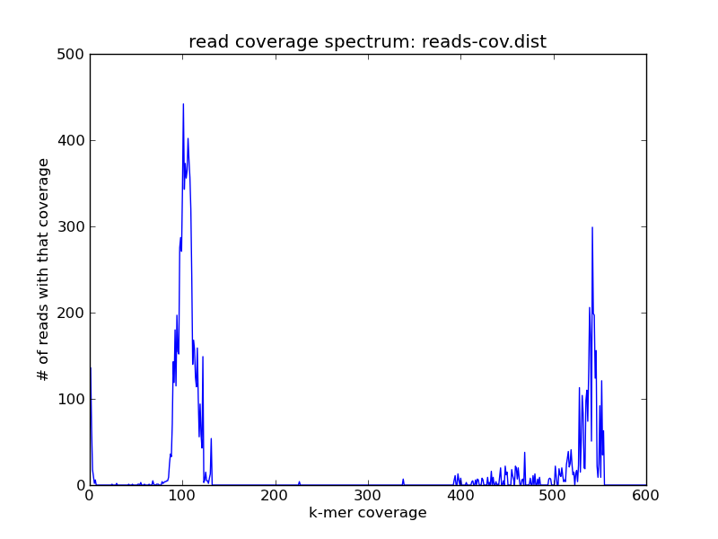
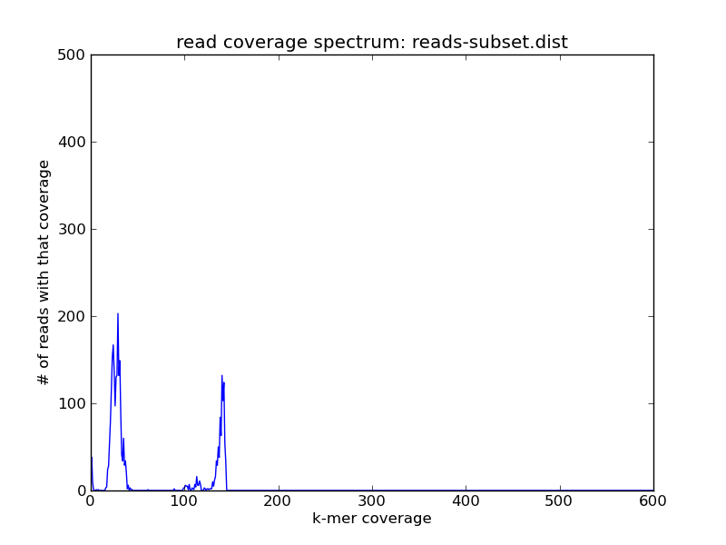
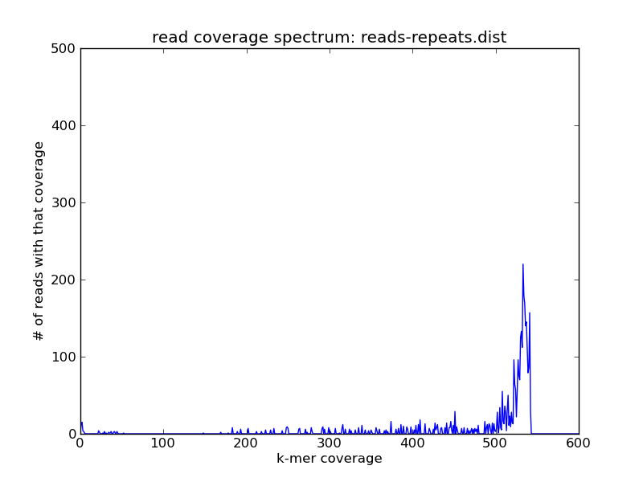

Downsampling shotgun reads to a given average coverage (assembly-free)
######################################################################

:author: C\. Titus Brown
:tags: khmer
:date: 2014-08-24
:slug: 2014-downsample-to-given-coverage
:category: science

The below is a recipe for subsetting a high-coverage data set to a
given average coverage.  This differs from digital normalization
because the relative abundances of reads should be maintained -- what
changes is the *average* coverage across all the reads.

Uses for this recipe include subsampling reads from a super-high
coverage data set for the purpose of assembly, as well as more
esoteric reasons (see the bottom of the post).  This approach won't
work on digitally normalized reads, and is primarily intended for
genomes and low-complexity metagenomes.  For high-complexity
metagenomes we recommend partitioning.

----

Note: at the moment, the khmer scripts ``collect-reads.py`` and
``slice-reads-by-coverage.py`` are in the khmer repository under
branch `feature/collect_reads
<https://github.com/ged-lab/khmer/pull/583>`__.  Once we've merged it
into the master branch and cut a release, we'll remove this note and
simply specify the khmer release required.

This recipe uses code from `khmer-recipes
<https://github.com/ctb/khmer-recipes/tree/master/002-collect-subset-of-high-coverage>`__
and `dbg-graph-null <https://github.com/ctb/dbg-graph-null>`__.

.. shell start

.. ::

   . ~/dev/ipy7/bin/activate
   
   # make a 500 bp repeat
   python ~/dev/dbg-graph-null/make-random-genome.py -l 500 -s 10 > repeat.fa
   
   # create a genome with 5kb unique sequence interspersed with 5x 500 bp
   # repeats.
   echo '>genome' > genome.fa
   cat repeat.fa | grep -v ^'>' >> genome.fa
   python ~/dev/dbg-graph-null/make-random-genome.py -l 1000 -s 1 | grep -v ^'>' >> genome.fa
   cat repeat.fa | grep -v ^'>' >> genome.fa
   python ~/dev/dbg-graph-null/make-random-genome.py -l 1000 -s 2 | grep -v ^'>' >> genome.fa
   cat repeat.fa | grep -v ^'>' >> genome.fa
   python ~/dev/dbg-graph-null/make-random-genome.py -l 1000 -s 3 | grep -v ^'>' >> genome.fa
   cat repeat.fa | grep -v ^'>' >> genome.fa
   python ~/dev/dbg-graph-null/make-random-genome.py -l 1000 -s 4 | grep -v ^'>' >> genome.fa
   cat repeat.fa | grep -v ^'>' >> genome.fa
   python ~/dev/dbg-graph-null/make-random-genome.py -l 1000 -s 5 | grep -v ^'>' >> genome.fa
   
   # build a read set
   python ~/dev/dbg-graph-null/make-reads.py -C 150 genome.fa > reads.fa

Let's assume you have a simple genome with some 5x repeats, and you've
done some shotgun sequencing to a coverage of 150 or higher.  If your reads are
in ``reads.fa``
::
   
   load-into-counting.py -x 1e8 -k 20 reads.kh reads.fa
   ~/dev/khmer/sandbox/calc-median-distribution.py reads.kh reads.fa reads-cov.dist
   ./plot-coverage-dist.py reads-cov.dist reads-cov.png --xmax=600 --ymax=500

and looks like this:

You see the same peaks at roughly the same places.

Now use ``collect-reads.py`` to subset the data to a lower average coverage
of 50
::

   ~/dev/khmer/sandbox/collect-reads.py -x 1e8 -C 50 -k 20 reads.subset.kh reads.fa -o reads.subset.fa

Here, ``collect-reads.py`` is walking through the data set and
computing a running average of the coverage of the last 1000 reads.
Once it hits the specified average coverage of 50 (``-C 50``) it stops
collecting the reads.  Take a look at the read coverage spectrum for
the subsetted data:
::

   ~/dev/khmer/sandbox/calc-median-distribution.py reads.subset.kh reads.subset.fa reads-subset.dist
   ./plot-coverage-dist.py reads-subset.dist reads-subset.png --xmax=600 --ymax=500

and compare the resulting plot with the one above --

Here you can see that the coverage spectrum has been shifted left and down
by the subsampling (which is what you'd expect).

Note that picking the coverage that you want is a bit tricky, because
it will be the *average* across the reads.  If you have a highly
repetitive genome you may need to go for something higher than your
desired single-copy genome coverage, because the repeats will skew your
average to the right.

Esoterica
~~~~~~~~~

If the peaks look good, you can use the output counting table
``reads.subset.kh`` as an argument to ``slice-reads-by-coverage`` (see `this post <http://ivory.idyll.org/blog/2014-slice-reads-by-coverage.html>`__).  If
you use the original reads, this will then give you _all_ the reads
that cluster by coverage with that peak.  For example, ::

   ~/dev/khmer/sandbox/slice-reads-by-coverage.py reads.subset.kh reads.fa reads-repeats.fa -m 100 -M 200

will give you *all* the reads from the repetitive component, which will be
much higher coverage in the combined data set; take a look:
::

   load-into-counting.py -x 1e8 -k 20 reads-repeats.kh reads-repeats.fa
   ~/dev/khmer/sandbox/calc-median-distribution.py reads-repeats.kh reads-repeats.fa reads-repeats.dist
   ./plot-coverage-dist.py reads-repeats.dist reads-repeats.png --xmax=600 --ymax=500

Here the slice specified (``-m`` and ``-M``) is with respect to the
read abundances in ``reads.subset.kh``).  This allows you to more
explore and subset large data sets than you would otherwise be able
to, and also avoids some khmer-specific issues with
counting k-mers that are higher abundance than 255.
