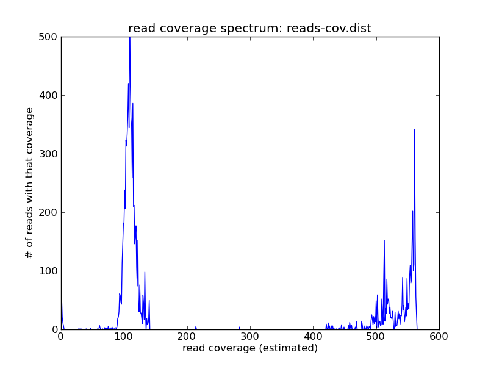

Recipe: Estimate genome size and coverage from shotgun sequencing data
######################################################################

:author: C\. Titus Brown
:tags: khmer
:date: 2014-09-07
:slug: 2014-estimate-total-genome-size
:category: science

In `Extracting shotgun reads based on coverage in the data set
<http://ivory.idyll.org/blog/2014-slice-reads-by-coverage.html>`__, we
showed how to get a read coverage spectrum for a shotgun data set.
This is a useful diagnostic tool that can be used to estimate total
genome size, average coverage, and repetitive content.

Uses for this recipe include estimating the sequencing depth of a
particular library, estimating the repeat content, and generally
characterizing your shotgun data.

See `Estimating (meta)genome size from shotgun data <http://ivory.idyll.org/blog/2014-estimate-genome-size-shotgun.html>`__ for
a recipe that estimates the *single-copy* genome size; that recipe can
be used for any metagenomic or genomic data set, including ones
subjected to whole genome amplification, while this recipe can only be
used for data from unamplified/unbiased whole genome shotgun
sequencing.

.. shell start

.. ::

   . ~/dev/ipy7/bin/activate
   set -e
   
   # make a 500 bp repeat
   python ~/dev/nullgraph/make-random-genome.py -l 500 -s 10 > repeat.fa
   
   # create a genome with 5kb unique sequence interspersed with 5x 500 bp
   # repeats.
   echo '>genome' > genome.fa
   cat repeat.fa | grep -v ^'>' >> genome.fa
   python ~/dev/nullgraph/make-random-genome.py -l 1000 -s 1 | grep -v ^'>' >> genome.fa
   cat repeat.fa | grep -v ^'>' >> genome.fa
   python ~/dev/nullgraph/make-random-genome.py -l 1000 -s 2 | grep -v ^'>' >> genome.fa
   cat repeat.fa | grep -v ^'>' >> genome.fa
   python ~/dev/nullgraph/make-random-genome.py -l 1000 -s 3 | grep -v ^'>' >> genome.fa
   cat repeat.fa | grep -v ^'>' >> genome.fa
   python ~/dev/nullgraph/make-random-genome.py -l 1000 -s 4 | grep -v ^'>' >> genome.fa
   cat repeat.fa | grep -v ^'>' >> genome.fa
   python ~/dev/nullgraph/make-random-genome.py -l 1000 -s 5 | grep -v ^'>' >> genome.fa
   
   # build a read set
   python ~/dev/nullgraph/make-reads.py -C 150 genome.fa > reads.fa

----

Let's assume you have a genome that you've sequenced to some unknown
coverage, and you want to estimate the total genome size, repeat
content, and sequencing coverage.  If your reads are in ``reads.fa``,
you can generate a read coverage spectrum from your genome like so:
::

   load-into-counting.py -x 1e8 -k 20 reads.kh reads.fa
   ~/dev/khmer/sandbox/calc-median-distribution.py reads.kh reads.fa reads-cov.dist
   ./plot-coverage-dist.py reads-cov.dist reads-cov.png --xmax=600 --ymax=500

and the result looks like this:

For this (simulated) data set, you can see three peaks: one on the far
right, which contains the high-abundance reads from repeats; one
in the middle, which contains the reads from the single-copy genome;
and one all the way on the left at ~1, which contains all of the
highly erroneous reads

Pick a coverage number near the peak that you think represents the
single-copy genome - with sufficient coverage, and in the absence of
significant heterozygosity, it should be the first peak that's well
to the right of zero.  Here, we'll pick 100.

Then run
::

   ./estimate-total-genome-size.py reads.fa reads-cov.dist 100

and you should see::

   Estimated total genome size is: 7666 bp
   Estimated size > 5x repeats is: 587 bp
   Estimated single-genome coverage is: 109.8

The true values (for this simulated genome) are 7500bp genome size,
500 bp > 5x repeat, and 150x coverage, so this isn't a terribly bad
set of estimates.  The single-genome coverage estimate is probably low
because we're estimating read coverage with a k-mer based approach,
which is sensitive to highly erroneous reads.

A few notes:

* Yes, you could automate the selection of the first peak, but I think
  it's always a good idea to look at your data!

* In the case of highly polymorphic diploid genomes, you would have to
  make sure to include the haploid reads but only count them 50%
  towards the final genome size.

Resources and Links
~~~~~~~~~~~~~~~~~~~

`This recipe
<https://github.com/ged-lab/khmer-recipes/tree/master/005-estimate-total-genome-size>`__
is hosted in the khmer-recipes repository,
https://github.com/ged-lab/khmer-recipes/.

It requires the `khmer software <http://khmer.readthedocs.org>`__.
