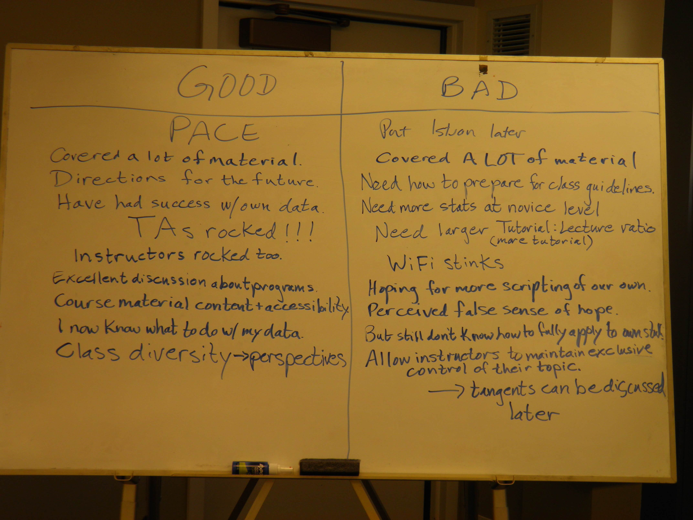
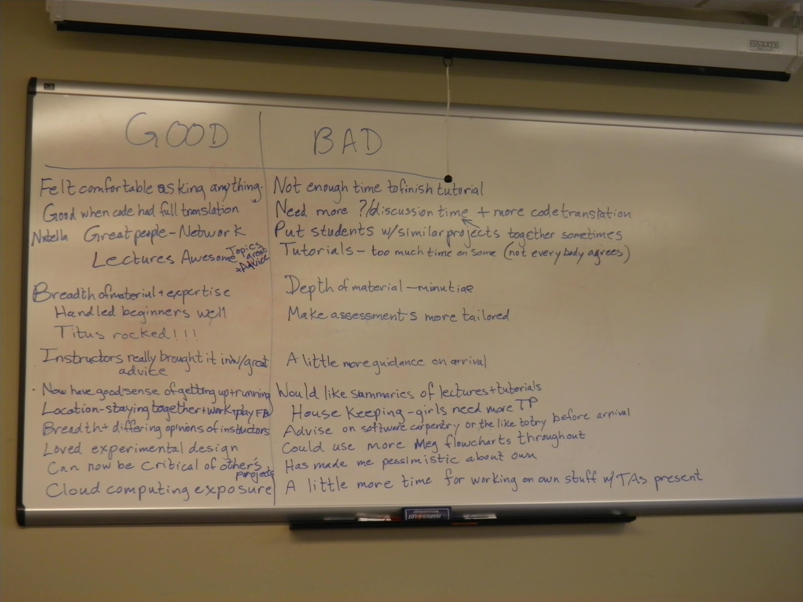

The fifth workshop on Analyzing Next Generation Sequencing Data
###############################################################

:author: C\. Titus Brown
:tags: ngs,bioinformatics,ngs-course
:date: 2014-08-20
:slug: 2014-fifth-angus
:category: science

The fifth annual `Analyzing Next Generation Sequencing Data workshop
just finished
<http://bioinformatics.msu.edu/ngs-summer-course-2014>`__ - #ngs2014.
As usual `the schedule and all of the materials are openly
available <http://angus.readthedocs.org/en/2014/>`__.

tl; dr? Good stuff.

We've been running this thing since 2010, and we now have almost 120
alumni (5 classes of roughly 24 students each).  The students come
from all over the world (although I think we're missing attendees from
Africa and Antarctica), and from many different types of institutions,
including top tier research universities, biotech, and non-profit
research centers.  The "students" vary in rank from graduate students
and staff to full professors; the age range goes from low 20s to a
fair bit older than me.

The class invariably starts with an introduction to cloud computing,
followed by a number of step-by-step tutorials through command line
BLAST, quality analysis of Illumina data, mapping, and assembly. We cover
basic analysis of your data, statistical considerations in sample
design and data analysis, automation, version control, R, Python,
IPython Notebook, mRNAseq analysis, and a variety of other topics.
The students take full advantage of the opportunity to ask an immense
variety of questions, ranging from algorithmic and technical to
fundamental scientific questions.

It's truly awesome, and I am unreasonably proud of this workshop!

This year the previous workshop faculty and instructors (Ian Dworkin,
Istvan Albert, Chris Chandler, Adina Howe) were joined by a newer
cohort, including Meg Staton, Matt MacManes, Daniel Standage, Aaron
Darling, and Martin Schilling.  The younger group of scientists
(Chris, Adina, Meg, Matt, Daniel, Aaron, and Martin) make me feel
old: they're young, enthusiastic, all about open science,
and totally into reproducibility and Software Carpentry and good
bioinformatics.  Many of them are now junior faculty, which really gives
me hope for the future!  Of particular note, Adina Howe *took* the course
in 2010 (the first time we offered it) and is now taking a position
as a big data biology junior faculty member -- how cool is that!?

Our TAs this year did a fantastic job.  Amanda Charbonneau was the
overall "cruise director", and Aswathy Sebastian, Will Pitchers,
Elijah Lowe, and Qingpeng Zhang served as TAs.

How did the course go this year?
--------------------------------

Each year we do an end-of-course discussion where I try to stay quiet
as the students dissect all of the bad decisions I made in organizing
the course.  This year, I took a page from Greg Wilson's handbook and
made the students offer up one good thing and one bad thing -- every
student had to provide at least one of each, and they had to be
non-overlapping.  We didn't entirely succeed at getting completely
non-overlapping feedback, but the lists are still
interesting and informative:

I think my favorite is "Good: covered a lot of material; bad: covered
A LOT of material!" although "I am worried that we now have a false
sense of hope" comes in as a close second.  Meg Staton should feel
proud that one of the comments boiled down to "more Meg", although it
came out as "more of Meg's flowcharts."  And of course there's the
always popular opinion that "if only you'd given us more to read up
front, we'd have come better prepared", which in my experience is an
incredibly over-optimistic lie, if well intentioned :).

Assessing the workshop
----------------------

This is now the third year we've run assessments on the workshop.  Our
expert assessment company, StemEd LLC, hasn't yet finished the
assessment report for 2014, but you can read the 2012 and 2013
evaluations `here <images/NGSSummer2012EvaluationResultsFINAL.pdf>`__
and `here <images/NGSSummer2013EvaluationResultsFINAL.pdf>`__.  These
aren't complete assessments -- we are still working on processing the
long-form answers -- and they are somewhat superficial, but overall
paint a very positive picture of the workshop. This is in line with
what we hear from the students both informally throughout, as well as
more formally at the end-of-workshop discussions.

One thing that surprised me this year (and I'm mentioning it because I
wouldn't have noticed if someone hadn't said it for their "one good
thing") was that people commented very positively on the diversity of
students, who came from all over the world (we covered all but two
South American countries!), had many different research backgrounds
and interests, and were at many different career stages.  While we are
in fact tempted to roll dice to choose the students (this year, we
accepted 24 of 170 applicants), we actually do spend some time trying
to balance the class -- and it seemed to work well this year!

Next years' plans
-----------------

We *are* planning to run the workshop against next year, at about the
same time and in the same place, but there are some potential
complications.  (More about those soon.)  

The biggest change that I think I'm going to put into place next year
is that the first ~5 days will be paced much more carefully.  Some
people come in with a lot of self-confidence and some solid expertise,
while others come in with little of either; the latter group is really
sensitive to being overwhelmed, while the former group is usually
eager to drink from the firehose (sometimes until they see just how
high we can turn up the pressure, hah).  I plan to address this by
making the first 5 days all about gentle-but-thorough introductions to
UNIX, mapping, assembly, and scripting.  In my experience, even
the people who come in with some knowledge get a lot out of the
more thorough introductions.  Then in the second week we'll go crazy
with a range of subjects.

As part of this change, I may restrict the first week lecturers to
trained Software Carpentry instructors.  This would include Adina
Howe, Meg Staton, and Martin Schilling, as well as myself (although
I'd like to offer to pay for other instructors to do the in-person
training if they were interested).  From what I observed, people who
haven't gone through Greg Wilson's training bootcamp are really
lacking in an ability to "read" the classroom - for one, they don't
pay enough attention to stickies, and for another, they are often too
enthusiastic to get to the cool stuff.  These instructors are
incredibly valuable after people have learned to tread water, but can
too easily drown students in the first week. I got a *lot* of feedback
this year that they needed to be introduced more carefully.  (There
are some people that are just ill-suited to instructing non-*experts*,
but I tend not to invite them -- I'm thinking of the first lecture at
another workshop, which (literally) started with "OK, now after
compiling and installing my software package, fire up vi and edit the
config file to reflect your local system settings. Then run the
program on the first demo file XXXX.")

Something else I need to make sure of is that I (or someone) remains
heavily involved in the course throughout.  This year I was distracted
by several different things, including three (!) thesis defenses on main
campus that took place during the course, and I didn't bring the
intensity.  Next year, **more intensity** (or perhaps a new workshop
director ;).

So that's my report for this year.

--titus
