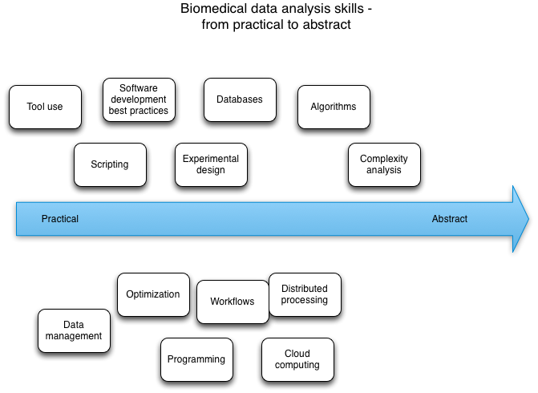
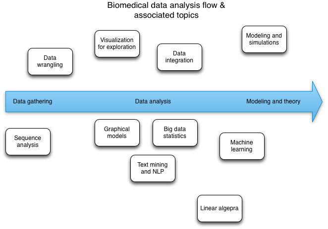

The NIH #ADDSup meeting - training breakout report
##################################################

:author: C\. Titus Brown
:tags: nih,adds,bd2k
:date: 2014-09-08
:slug: 2014-nih-adds-training-breakout
:category: teaching

At `the NIH ADDS meeting
<http://ivory.idyll.org/blog/2014-nih-adds-up-meeting.html>`__, we had
several breakout sessions.  Michelle Dunn and I led the training
session.  For this breakout, we had the following agenda:

First, build "sticky-note clouds", with one sticky-note cloud with notes
for each of the following topics:

1. Desired outcomes of biomedical data science training;

2. Other relevant training initiatives and connections;

3. Topics that are part of data science;

4. Axes of issues (e.g. online training, vs in person?)

Second, coalesce and summarize each topic;

Third, refine concepts and issues;

and fourth, come back with:

A. three recommended actionable items that NIH can do _now_
B. three things that NIH should leave to others (but be aware of)

This was not the greatest agenda, because we ended up spending only a very
little time at the end talk about specific actionable items, but otherwise
it was a great brainstorming session!

You can read the output document `here <https://docs.google.com/document/d/1rzYYG-Lxr4i7tE2guY9VM3gOq_jyQoCfVpaeUOPIUmk/edit>`__; below, I expand and
elaborate on what _I_ think everything meant.

Desired outcomes:
-----------------

In no particular order,

* Increased appreciation by biomedical scientists of the role that data science could play;
* More biomedical scientists biologists using data science tools;
* More data scientists developing tools for biology;
* Increased cross-training of data scientists in biology;
* Map(s) and guidebooks to the data science landscape;
* Increased communication between biomedical scientists and data scientists;
* Making sure that all biomed grad students have a basic understanding of data science;
* Increased data science skills for university staff who provide services

Data science topics list
------------------------

Data science topics list:

Stat & experimental design, modeling, math, prob, stochastic
processing, NLP/text mining, Machine learning, inference, viz for
exploration, regression, classification, Graphical models, data
integration

CS - principles of metadata, metadata format algorithms, databases,
optimization, complexity, programming, scripting, data management,
data wrangling, distributed processing, cloud computing, software
development, scripting, Workflows, tool usage

Presentation of results, computational thinking, statistical thinking

We arranged these topics on two diagrams, one set on the "data
analysis workflow" chart and one set on the "practical to abstract skill"
chart.

Patches welcome -- I did these in OmniGraffle, and you can grab the
files `here <images/2014-biomedical-data-abstractions-addsup.graffle>`__ and `here <images/2014-biomedical-data-flow-addsup.graffle>`__.

Axes/dichotomies of training:
-----------------------------

The underlying question here was, how multidimensional is the biomedical
training subspace?  (Answer: D is around 10.)

* Clinical to biomedical to basic research - what topics do you target with your training?
* Just-in-time vs. background training - do you train for urgent research needs, or for broad background skills?
* Formal vs. informal - is the training formal and classroom oriented, or more informal and unstructured?
* Beginner vs. advanced - do you target beginner level or advanced level students?
* In-person vs. online - do you develop online courses or in-person courses?
* Short vs. long - short (two-day, two week) or long (semester, longer) or longer (graduate career) training?
* Centralized physically vs. federated/distributed physically - training centers, to which everyone travels? Or do you fly the trainers to the trainees? Or do you train the trainers and then have them train locally?
* Andragogy v. pedagogy (Full professor through undergrads) - do your target more senior or more junior people?
* Project-based vs. structured - do you assign open projects, or fairly stereotyped ones, or just go with pure didactic teaching?
* Individual learning vs team learning - self-explanatory.

I should say that I, at least, have no strong evidence that any one
point on any of these spectra will be a good fit for even a large
minority of potential trainees and goals; we're just trying to lay out
the options here.

Existing training initiatives and data science connections:
-----------------------------------------------------------

* data science MOOCs, generally.
* `Software Carpentry <http://software-carpentry.org/>`__ and `Data Carpentry <http://datacarpentry.org/>`__
* `ELIXIR <http://www.elixir-europe.org/>`__ and especially `ELIXIR-UK <http://elixir-uk.org/>`__
* the NSF BIO Centers have several coordination grants that have converged on training (Data Carpentry emerged from two of them)
* Training NSF RCNs
* the Moore/Sloan Data Science Environments (`UC Berkeley BIDS <http://vcresearch.berkeley.edu/datascience>`__, , `NYU CDS <http://cds.nyu.edu/>`__, `University of Washington <http://escience.washington.edu/>`__
* `GOBLET <http://mygoblet.org/>`__
* The various QIIME Workshops that Rob Knight and Greg Caporaso run
* Existing and upcoming funded NIH R25s, including `MBL STAMPS <https://stamps.mbl.edu/index.php/Main_Page>`__, and `MSU NGS <http://bioinformatics.msu.edu/ngs-summer-course-2014>`__.
* More generally, any of `these bioinformatics courses <http://ged.msu.edu/angus/bioinformatics-courses.html>`__

----

Recommendations:
----------------

(The first two were from the group; the last three were from the meeting
more broadly)

1. Solicit “crazier” R25s in existing BD2K framework; maybe open up
   another submission round before April.

   Provide a list of topics and axes from our discussion; fund things
   like good software development practice, group-project camp for
   biomedical data driven discovery, development of good online data sets
   and explicit examples, hackathons, data management and metadata
   training, software development training, and communication training.

2. Solicit proposals for training coordination cores (2-3) to gather,
   catalog, and annotate existing resources, cooperate nationally and
   internationally, and collaborate on offering training. Also, develop
   evaluation and assessment criteria that can be applied across
   workshops.

3. CTB: fund early stage more broadly; don’t just limit training to
   graduate students in biomedical fields. For example, the biology
   grad student of today is the biomedical post doc of tomorrow.

4. Mercè Crosas: Fund internships, hands-on collaborative
   contributions in multi-disciplinary Data Science Labs

5. Leverage T-32 existing by adding req to include data
   science. (Addendum: there are already supplements available `to do this <http://grants.nih.gov/grants/guide/rfa-files/RFA-HG-14-005.html>`__)

6. Right now we're evaluating education grants individually; it would
   be good to also have a wide and deep evaluation done *across*
   grants.

----

A few other comments --

Training should cover senior and junior people

About 3% of the NIH budget is spent on training

Also, Daniel Mietchen (via online document comment) said: Consider
using open formats. A good example is the Knight Challenge, currently
asking for proposals around the future of libraries:
https://www.newschallenge.org/challenge/libraries/brief.html

----

and that's all, folks!

--titus

