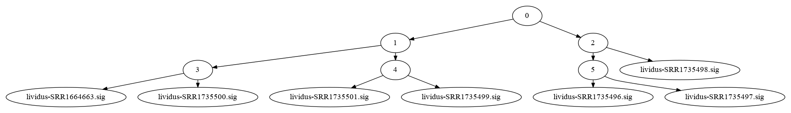
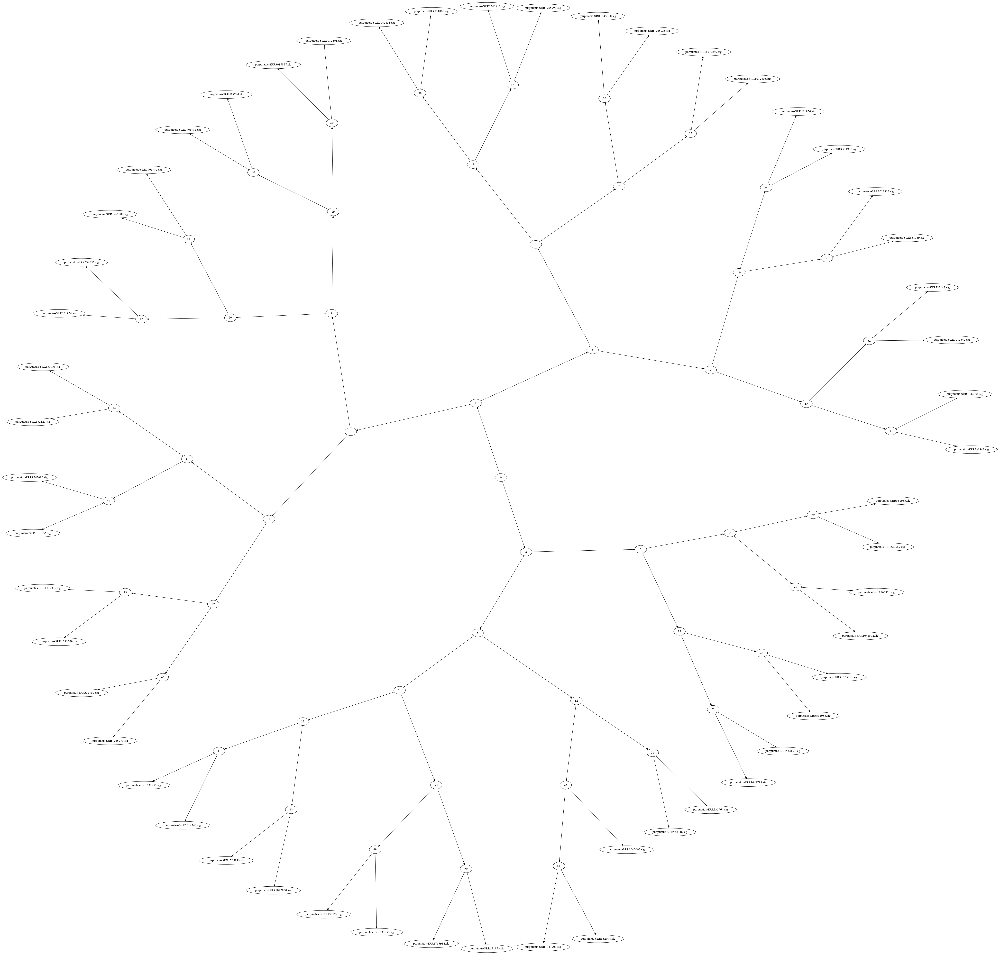

Efficiently searching MinHash Sketch collections
################################################

:author: C\. Titus Brown
:tags: minhash,sourmash,ddd, Bloom filters
:date: 2016-11-19
:slug: 2016-sourmash-sbt
:category: science

Note: This blog post is based largely on work done by Luiz Irber.
Camille Scott, Luiz Irber, Lisa Cohen, and Russell Neches all
collaborated on the SBT software implementation!

----

We've been pretty enthusiastic about MinHash Sketches over here in
Davis (`read here <http://ivory.idyll.org/blog/2016-sourmash.html>`__
and `here
<http://ivory.idyll.org/blog/2016-sourmash-signatures.html>`__ for
background, or go `look at mash directly
<https://github.com/marbl/Mash>`__), and I've been working a lot on
applying them to metagenomes.  Meanwhile, `Luiz Irber <https://twitter.com/luizirber?lang=en>`__ has been thinking about how to build MinHash signatures
for `all the data <https://www.ncbi.nlm.nih.gov/sra>`__.

A problem that Luiz and I both needed to solve is the question of how
you efficiently search hundreds, thousands, or even millions of
MinHash Sketches.  I thought about this on and off for a few months
but didn't come up with an obvious solution.

Luckily, Luiz is way smarter than me and quickly figured out that
`Sequence Bloom Trees
<https://www.cs.cmu.edu/~ckingsf/software/bloomtree/>`__ were the
right answer. Conveniently as part of `my review of Solomon and Kingsford (2015)
<http://ivory.idyll.org/blog/2015-sequence-bloom-trees-thoughts.html>`__
I had put together a BSD-compatible `SBT implementation in Python
<https://github.com/ctb/2015-sbt-demo>`__.  Even more conveniently,
my students and colleagues at UC Davis `fixed my somewhat broken
implementation <https://github.com/dib-lab/2015-09-10-scihack>`__, so
we had something ready to use.  It apparently took Luiz around a
nanosecond to `write up a Sequence Bloom Tree implementation that
indexed, saved, loaded, and searched MinHash sketches
<https://nbviewer.jupyter.org/github/luizirber/2016-sbt-minhash/blob/master/notebooks/SBT%20with%20MinHash%20leaves.ipynb>`__.
(I don't want to minimize his work - that was a nanosecond
on top of an awful lot of training and experience. :)

Sequence Bloom Trees can be used to search many MinHash sketches
----------------------------------------------------------------

Briefly, an SBT is a binary tree where the leaves are collections of
k-mers (here, MinHash sketches) and the internal nodes are Bloom filters
containing all of the k-mers in the leaves underneath them.

Here's a nice image from Luiz's `notebook
<https://nbviewer.jupyter.org/github/luizirber/2016-sbt-minhash/blob/master/notebooks/SBT%20with%20MinHash%20leaves.ipynb>`__:
here, the leaf nodes are MinHash signatures from `our sea urchin RNAseq
collection
<https://github.com/dib-lab/sourmash/tree/master/demo/urchin>`__, and
the internal nodes are `khmer <https://github.com/dib-lab/khmer/>`__
Nodegraph objects containing all the k-mers in the MinHashes beneath them.

These images can be very pretty for larger collections!

The basic idea is that you build the tree once, and then to search it
you prune your search by skipping over internal nodes that DON'T contain
k-mers of interest.  As usual for this kind of search, if you search
for something that is only in a few leaves, it's super efficient;
if you search for something in a lot of leaves, you have to walk over
lots of the tree.

This idea was so obviously good that I jumped on it and integrated the
Luiz's SBT functionality into `sourmash
<http://joss.theoj.org/papers/3d793c6e7db683bee7c03377a4a7f3c9>`__,
our Python library for calculating and searching MinHash sketches.
The `pull request <https://github.com/dib-lab/sourmash/pull/45>`__ is
still open -- more on that below -- but the PR currently adds two new
functions, ``sbt_index`` and ``sbt_search``, to index and search
collections of sketches.

Using sourmash to build and search MinHash collections
------------------------------------------------------

This is already usable!

Starting from a blank Ubuntu 15.10 install, run::

   sudo apt-get update && sudo apt-get -y install python3.5-dev \
        python3-virtualenv python3-matplotlib python3-numpy g++ make

then create a new virtualenv, ::

   cd
   python3.5 -m virtualenv env -p python3.5 --system-site-packages
   . env/bin/activate

You'll need to install a few things, including a recent version of khmer::

   pip install screed pytest PyYAML
   pip install git+https://github.com/dib-lab/khmer.git

Next, grab the sbt_search branch of sourmash::

   cd
   git clone https://github.com/dib-lab/sourmash.git -b sbt_search

and then build & install sourmash::

   cd sourmash && make install

Once it's installed, you can index any collection of signatures like so::

   cd ~/sourmash
   sourmash sbt_index urchin demo/urchin/{var,purp}*.sig

It takes me about 4 seconds to load 70-odd sketches into an sbt index
named 'urchin'.

Now, search!

This sig is in the index and takes about 1.6 seconds to find::

   sourmash sbt_search urchin demo/urchin/variegatus-SRR1661406.sig

Note you can adjust the search threshold, in which case the search
truncates appropriately and takes about 1 second::

   sourmash sbt_search urchin demo/urchin/variegatus-SRR1661406.sig --threshold=0.3

This next sig is not in the index and the search takes about 0.2
seconds (which is basically how long it takes to load the tree
structure and search the tree root). ::
   
   sourmash sbt_search urchin demo/urchin/leucospilota-DRR023762.sig 

How well does this scale?  Suppose, just hypothetically, that you had, oh,
say, a thousand bacterial genome signatures lying around and you wanted to
index and search them? ::

   # download
   mkdir bac
   cd bac
   curl -O http://teckla.idyll.org/~t/transfer/sigs1k.tar.gz
   tar xzf sigs1k.tar.gz

   # index
   time sourmash sbt_index 1k *.sig
   time sourmash sbt_search 1k GCF_001445095.1_ASM144509v1_genomic.fna.gz.sig

Here, the indexing takes about a minute, and the search takes about 5 seconds
(mainly because there are a lot of closely related samples).

The data set sizes are nice and small -- the 1,000 signatures are 4 MB
compressed and 12 MB uncompressed, the SBT index is about 64 MB, and
this is all representing about 5 Gbp of genomic sequence.  (We haven't
put any time or effort into optimizing the index so things will only
get smaller and faster.)

How far can we push it?
-----------------------

There's lots of bacterial genomes out there, eh? Be an AWFUL SHAME if
someone INDEXED them all for search, wouldn't it?

Jiarong Guo, a postdoc split between my lab and Jim Tiedje's lab at MSU,
helpfully downloaded 52,000 bacterial genomes from NCBI for another
project.  So I indexed them with sourmash.

Indexing 52,000 bacterial genomes took about 36 hours on the MSU HPC,
or about 2.5 seconds per genome.  This produced about 1 GB of
uncompressed signature files, which `in tar.gz form
<http://spacegraphcats.ucdavis.edu.s3.amazonaws.com/bacteria-sourmash-signatures-2016-11-19.tar.gz>`__
ends up being about 208 MB.

I loaded them into an SBT like so::

    /usr/bin/time -s sourmash sbt_index bacteria --traverse-directory bacteria-sourmash-signatures-2016-11-19

This took about 53 minutes on an m4.xlarge EC2 instance, and required
4.2 GB of memory.  The resulting tree was about 4 GB in size.

Searching the tree (for GCF_000006965.1_ASM696v1_genomic.fna.gz.sig) took
about 3 seconds (and found 31 matches).  It requires only 100 MB of RAM,
because it uses on-demand loading of the tree.

I'm sure we can speed this all up, but I have to say that's already
pretty workable :).

You can download the 800 MB .tar.gz containing the SBT for all
bacterial genomes here: `bacteria-sourmash-sbt-2016-11-19.tar.gz
<http://spacegraphcats.ucdavis.edu.s3.amazonaws.com/bacteria-sourmash-sbt-2016-11-19.tar.gz>`__.

Example use case: finding genomes close to Shewanella oneidensis MR-1
---------------------------------------------------------------------

What would you use this for? Here's an example use case.

Suppose you were interested in genomes with similarity to
Shewanella oneidensis MR-1.

First, go to the `S. oneidensis MR-1 assembly page <https://www.ncbi.nlm.nih.gov/genome/1082?genome_assembly_id=170432>`__, click on the "Assembly:" link,
and find `the genome assembly .fna.gz file <ftp://ftp.ncbi.nlm.nih.gov/genomes/all/GCF/000/146/165/GCF_000146165.2_ASM14616v2/GCF_000146165.2_ASM14616v2_genomic.fna.gz>`__.

Now, go download it::

  curl ftp://ftp.ncbi.nlm.nih.gov/genomes/all/GCF/000/146/165/GCF_000146165.2_ASM14616v2/GCF_000146165.2_ASM14616v2_genomic.fna.gz > shewanella.fna.gz

Next, convert it into a signature::

  sourmash compute -f shewanella.fna.gz

(which takes 2-3 seconds to produce ``shewanella.fna.gz.sig``.

And, now, search with your new signature::

  sourmash sbt_search bacteria shewanella.fna.gz.sig

which produces this output::

  # running sourmash subcommand: sbt_search
  1.00 ../GCF_000146165.2_ASM14616v2_genomic.fna.gz
  0.09 ../GCF_000712635.2_SXM1.0_for_version_1_of_the_Shewanella_xiamenensis_genome_genomic.fna.gz
  0.09 ../GCF_001308045.1_ASM130804v1_genomic.fna.gz
  0.08 ../GCF_000282755.1_ASM28275v1_genomic.fna.gz
  0.08 ../GCF_000798835.1_ZOR0012.1_genomic.fna.gz

telling us that not only is the original genome in the bacterial
collection (the one with a similarity of 1!) but there are four other
genomes in with about 9% similarity.  These are other (distant)
strains of Shewanella.  The reason the similarity is so small is that
sourmash is by default looking at k-mer sizes of 31, so we're asking
how many k-mers of length 31 are in common between the two genomes.

With little modification (k-mer error trimming), this same pipeline
can be used on unassembled FASTQ sequence; streaming classification of
FASTQ reads and metagenome taxonomy breakdown are simple extensions
and are left as exercises for the reader.

What's next? What's missing?
----------------------------

This is all still early dates; the code's not terribly well tested and
a lot of polishing needs to happen. But it looks promising!

I still don't have a good sense for exactly how people are going to use
MinHashes.  A command line implementation is all well and good but some
questions come to mind:

* what's the right output format? Clearly a CSV output format for the
  searching is in order.  Do people want a scripting interface, or a command
  line interface, or what?

* related - what kind of structured metadata should we support in the
  signature files? Right now it's pretty thin, but if we do things like
  sketch all of the bacterial genomes and all of the SRA, we should probably
  make sure we put in some of the metadata :).

* what about at tagging interface so that you can subselect types of nodes
  to return?

If you are a potential user, what do you want to do with large
collections of MinHash sketches?

----

On the developer side, we need to:

* test, refactor, and polish the SBT stuff;

* think about how best to pick Bloom filter sizes automatically;

* benchmark and optimize the indexing;

* `make sure that we interoperate with mash <https://github.com/marbl/Mash/issues/27>`__

* evaluate the SBT approach on 100s of thousands of signatures, instead
  of just 50,000.

and probably lots of things I'm forgetting...

--titus

p.s. Output of /usr/bin/time -v on indexing 52,000 bacterial genome signatures::

        Command being timed: "sourmash sbt_index bacteria --traverse-directory bacteria-sourmash-signatures-2016-11-19"
        User time (seconds): 3192.58
        System time (seconds): 14.66
        Percent of CPU this job got: 99%
        Elapsed (wall clock) time (h:mm:ss or m:ss): 53:35.72
        Average shared text size (kbytes): 0
        Average unshared data size (kbytes): 0
        Average stack size (kbytes): 0
        Average total size (kbytes): 0
        Maximum resident set size (kbytes): 4279056
        Average resident set size (kbytes): 0
        Major (requiring I/O) page faults: 0
        Minor (reclaiming a frame) page faults: 8014404
        Voluntary context switches: 972
        Involuntary context switches: 5742
        Swaps: 0
        File system inputs: 0
        File system outputs: 6576144
        Socket messages sent: 0
        Socket messages received: 0
        Signals delivered: 0
        Page size (bytes): 4096
        Exit status: 0
