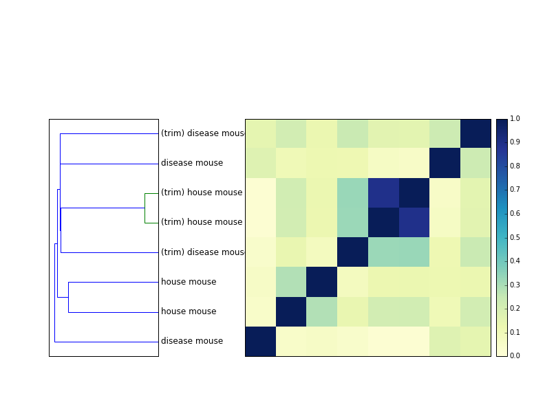
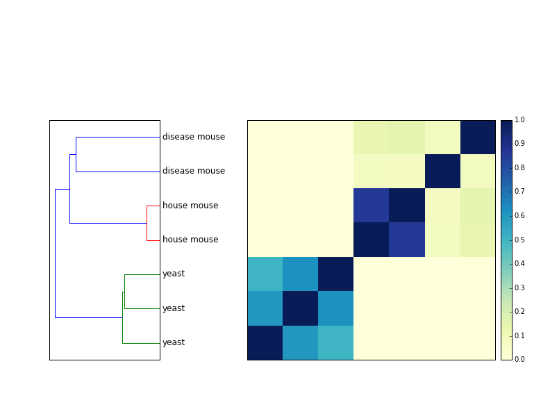
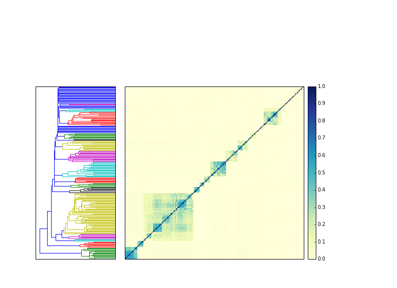
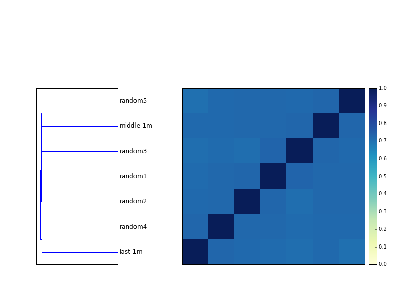
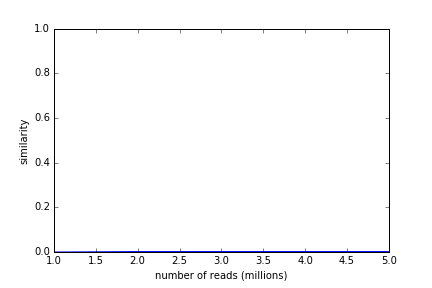
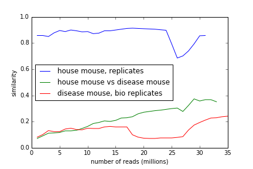
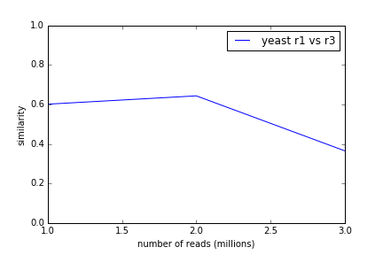
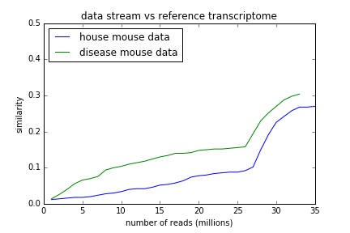

Applying MinHash to cluster RNAseq samples
##########################################

:author: C\. Titus Brown
:tags: minhash,sourmash,ddd
:date: 2015-04-14
:slug: 2016-sourmash
:category: science

(I gave a talk on this on Monday, April 11th - you can see the slides
slides `here, on figshare <https://figshare.com/articles/Data_structures_and_algorithms_for_interacting_with_infinite_amounts_of_sequencing_data/3171706>`__.

This is a Reproducible Blog Post. You can regenerate all the figures
and play with this software yourself on `binder
<http://mybinder.org/repo/dib-lab/sourmash/>`__.)

----

So, my latest enthusiasm is MinHash sketches.

A few weeks back, I had the luck to be asked to review both the `mash
<https://github.com/marbl/Mash>`__ paper (`preprint here
<http://biorxiv.org/content/early/2015/10/26/029827>`__) and the
`MetaPalette <https://github.com/dkoslicki/MetaPalette>`__ paper
(`preprint here
<http://biorxiv.org/content/early/2016/02/17/039909>`__).  The mash
paper made me learn about `MinHash sketches
<https://en.wikipedia.org/wiki/MinHash>`__, while the MetaPalette
paper made some very nice points about shared k-mers and species
identification.

After reading, I got to thinking.

I wondered to myself, hey, could I use MinHash signatures to cluster
unassembled Illumina RNAseq samples?  While the mash folk showed that
MinHash could be applied to raw reads nicely, I guessed that the
greater dynamic range of gene expression would cause problems - mainly
because high-abundance transcripts would yield many, many erroneous
k-mers.  Conveniently, however, my lab has some `not-so-secret sauce <https://peerj.com/preprints/890/>`__ for dealing with this problem - would it work,
here? I thought it might.

Combined with all of this, my former grad student, `Dr. Qingpeng Zhang
<http://www.qingpeng.org/>`__ (first author on the not-so-secret
sauce, above) has some *other* still-unpublished work showing that the
the first ~1m reads of metagenome samples can be used to cluster
samples together.

So, I reasoned, perhaps it would work well to stream the first million
or so reads from the beginning of RNAseq samples through our error
trimming approach, compute a MinHash signature, and then use that
signature to identify the species from which the RNAseq was isolated
(and perhaps even closely related samples).

tl; dr? It seems to work, with some modifications.

For everything below, I used a k-mer hash size of 32 and only chose read
data sets with reads of length 72 or higher.

(Here's `a nice presentation
<https://docs.google.com/presentation/d/10gbjzav8R2MwW1_1pDCuPGt2ev3rNWa-S5WCswBUEPU/edit#slide=id.g105d8a52f0_0_355>`__
on MinHash, via Luiz Irber.)

MinHash is super easy to implement
==================================

I implemented MinHash in only a few lines of Python; see the
repository at https://github.com/dib-lab/sourmash/.  The most relevant
code is `sourmash_lib.py
<https://github.com/dib-lab/sourmash/blob/2016-apr-blog/sourmash_lib.py#L11>`__. Here,
I'm using a bottom sketch, and at the moment I'm building some of it
on top of `khmer <http://github.com/dib-lab/khmer>`__, although I will
probably remove that requirement soon.

After lots of trial and error (some of it reported below), I settled
on using a k-mer size of k=32, and a sketch size of 500.  (You can go
down to a sketch size of 100, but you lose resolution.  Lower k-mer
sizes have the expected effect of slowly decreasing resolution; odd
k-mer sizes effectively halve the sketch size.)

How fast is it, and how much memory does it use, and how big are the sketches?
==============================================================================

I haven't bothered benchmarking it, but

* everything but the hash function itself is on Python;
* on my 3 yro laptop it takes about 5 minutes to add 1m reads;
* the memory usage of sourmash itself is negligible - error trimming
  the reads requires about 1 GB of RAM;
* the sketches are tiny - less than a few kb - and the program is
  dominated by the Python overhead.

So it's super fast and super lightweight.

Do you need to error trim the reads?
====================================

The figure below shows a dendrogram next to a distance matrix of 8
samples - four mouse samples, untrimmed, and the same four mouse
samples, trimmed at low-abundance k-mers.  (You can see the trimming
command `here
<https://github.com/dib-lab/sourmash/blob/2016-apr-blog/utils/trim-noV.sh>`__,
using khmer's trim-low-abund command.)

The two house mouse samples are replicates, and they always cluster
together.  However, they are much further apart without trimming.

The effect of trimming on the disease mouse samples (which are independent
biological samples, I believe) is much less; it rearranges the tree a bit
but it's not as convincing as with the trimming.

So you seem to get better resolution when you error trim the reads,
which is expected.  The signal isn't as strong as I thought it'd be,
though.  Have to think about that; I'm surprised MinHash is that
robust to errors!

Species group together pretty robustly with only 1m reads
=========================================================

How many reads do you need to use? If you're looking for species groupings,
not that many -- 1m reads is enough to cluster mouse vs yeast separately.
(Which is good, right? If that didn't work...)

Approximately 1m reads turns out to work equally well for 200 echinoderm
(sea urchin and sea star) samples, too.

Here, I downloaded all 204 echnoderm HiSeq mRNAseq data sets from SRA, trimmed
them as above, and computed the MinHash signatures, and then compared
them all to each other.  The blocks of similarity are all specific
species, and all the species groups cluster properly, and none of them
(with one exception) cluster with other species.

This is also an impressive demonstration of the speed of MinHash - you
can do all 204 samples against each other in about 10 seconds.  Most of
that time is spent loading my YAML format into memory; the actual
comparison takes < 1s!

(The whole notebook for making all of these figures takes less than 30
seconds to run, since the signatures are already there; `check it out! <http://mybinder.org/repo/dib-lab/sourmash/>`__)

Species that do group together may actually belong together
===========================================================

In the urchin clustering above, there's only one "confused" species
grouping where one cluster contains more than one species - that's
Patiria miniata and Patiria pectinifera, which are both bat stars.

.. figure:: ./images/sourmash-patiria.png
   :width: 60%

I posted this figure on Facebook and noted the grouping, and Dan
Rokhsar pointed out that on Wikipedia, `Patiria has been identified as
a complex of three closely related species in the Pacific
<https://en.wikipedia.org/wiki/Bat_star>`__.

So that's good - it seems like the only group that has cross-species
clustering is, indeed, truly multi-species.

You can sample any 1m reads and get pretty similar results
==========================================================

In theory, FASTQ files from shotgun sequencing are perfectly random,
so you should be able to pick any 1m reads you want - including the
first 1m. In practice, of course, this is not true.  How similar are
different subsamples?

Answer: quite similar.  All seven 1m read subsamples (5 random, one from
the middle, one from the end) are above 70% in similarity.

(Very) widely divergent species don't cross-compare at all
==========================================================

If you look at (say) yeast and mouse, there's simply no similarity there
at all. 32-mer signatures are apparently very specific.

(The graph below is kind of stupid. It's just looking at similarity between
mouse and yeast data sets as you walk through the two data streams.
It's 0.2% all the way.)

           
Species samples get more similar (or stay the same) as you go through the stream
================================================================================

What happens when you look at more than 1m reads? Do the streams get more
or less similar?

If you walk through two streams and update the MinHash signature regularly,
you see either constant similarity or a general increase in similarity;
in the mouse replicates, it's constant and high, and between disease mouse
and house mouse, it grows as you step through the stream.

(The inflection points are probably due to how we rearrange the reads
during the abundance trimming. More investigation needed.)

           
Yeast replicates also maintain high similarity through the data stream.

           
What we're actually doing is mostly picking k-mers from the transcriptome
=========================================================================

(This is pretty much what we expected, but as my dad always said, "trust
but verify.")

The next question is, what are we actually seeing signatures of?

For example, in the above mouse example, we see growing similarity
between two mouse data sets as we step through the data stream. Is this
because we're counting more sequencing artifacts as we look at more
data, or is this because we're seeing true signal?

To investigate, I calculated the MinHash signature of the mouse RNA
RefSeq file, and then asked if the streams were getting closer to
that as we walked through them.  They are:

So, it seems like part of what's happening here is that we are looking
at the True Signature of the mouse transcriptome.  Good to know.

And that's it for today, folks.

What can this be used for?
==========================

So, it all seems to work pretty well - `the mash folk
<https://mash.readthedocs.org>`__ are dead-on right, and this is a
pretty awesome and simple way to look at sequences.

Right now, my approach above seems like it's most useful for
identifying what species some RNAseq is from.  If we can do that, then
we can start thinking about other uses. If we can't do that pretty
robustly, then that's a problem ;).  So that's where I started.

It might be fun to run against portions of the SRA to identify
mislabeled samples.  Once we have the SRA digested, we can make that
available to people who are looking for more samples from their
species of interest; whether this is useful will depend.  I'm guessing
that it's not immediately useful, since the SRA species identification
seem pretty decent.

One simple idea is to simply run this on each new sample you get back
from a sequencing facility.  "Hey, this looks like Drosophila. ...did
you intend to sequence Drosophila?" It won't work for identifying
low-lying contamination that well, but it could identify mis-labeled
samples pretty quickly.

Tracy Teal suggested that this could be used in-house in large labs to
find out if others in the lab have samples of interest to you.  Hmm.
More on that idea later.

Some big remaining questions
============================

* **Do samples actually cluster by expression similarity?** Maybe - more
  work needed.

* **Can this be used to compare different metagenomes using raw
  reads?** No, probably not very well. At least, the metagenomes I
  care about are too diverse; you will probably need a different
  strategy.  I'm thinking about it.

One last shoutout
=================

I pretty much reimplemented parts of `mash
<https://mash.readthedocs.org>`__; there's nothing particularly novel
here, other than exploring it in my own code on public data :).  So,
thanks, mash authors!

--titus
