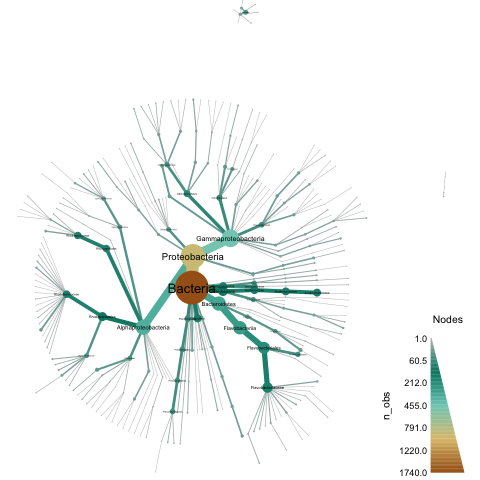

Title: Classifying genome bins using a custom reference database, part I (Saturday Morning Bioinformatics)
Date: 2017-09-09
Category: science
Tags: bioinformatics, tara, minhash, ngs, metagenomics, smb, taxonomy
Slug: 2017-classify-genome-bins-with-custom-db-part-1
Authors: C. Titus Brown
Summary: Classifying genome bins! With pictures!

Last week, Trina McMahon sent up a Twitter flare, [asking for a tool that would taxonomically classify genome bins using a custom reference database](https://twitter.com/quendi/status/905442912397348864).  Based on having watched [her excellent JGI talk](https://www.youtube.com/watch?v=_f2w_Q7tUnQ&list=PLDFwCQW-AVQA1HjQ-r1bsasvHUvZH44iV&index=5), my understanding was that Trina was interested in taking single-cell and metagenome assembled genomes (SAGs and MAGs, in the parlance of the day - I'll just call them "bins" below) and identifying those using private databases. One particular use case of interest was [using in-house databases of SAGs and MAGs that had already been classified](https://twitter.com/quendi/status/905443027434561539).

I don't know how connected Trina's comment was to my previous blogging, but last Monday I put together [a short blog post on taxonomic exploration of two sets of genome bins extracted from the Tara ocean data](http://ivory.idyll.org/blog/2017-taxonomy-of-tara-ocean-genomes.html). That blog post focused rather narrowly on identifying genome bins that might be "confused" in the sense that they contained k-mers with disagreeing taxonomic assignments (see [my blog post on k-mers and taxonomy](http://ivory.idyll.org/blog/2017-something-about-kmers.html) for info here).  Using the code in that blog post, it was in theory quite easily to do taxonomic assignments of unassigned genome bins.

Separately, Tom Delmont (the lead author on one of the genome binning studies I'd used for the blog post) [implied that they had not compared their genome bins to GenBank genomes](http://ivory.idyll.org/blog/2017-comparing-genomes-from-metagenomes.html#comment-3502629500).  That was basically the same problem that Trina wanted solved.

So, I put together a script to do something simple but hopefully useful, and (bonus!!) I added some pretty viz using [metacodeR](https://grunwaldlab.github.io/metacoder_documentation/).  The end result of applying taxonomic classification to a directory (with plotting) looks something like this, for the Tully et al. study:



----

When reading the stuff below, please bear in mind that I am doing nucleotide-level classification, which is only going to work at the ~species level.  If you are interested in [an approach that is more sensitive for more distant evolutionary relationships, see Meren's blog on their classification approach using CheckM](http://merenlab.org/data/2017_Delmont_et_al_HBDs/#taxonomical-inference-of-the-redundant-mags-using-checkm).

All of the below was run on my laptop in under ~2 GB of RAM and less than 10 minutes of compute.

-----

## Starting at the end

If you want to use the ~100,000 Genbank genomes to classify your genome bins, and you already have a directory of genome signatures computed with sourmash, then you can run the [classify-genome-sigs.py](https://github.com/ctb/2017-tara-binning/blob/master/classify-genome-sigs.py) script like so:

```
# download genbank DB
curl -L https://osf.io/zfmbd/download?version=1 -o genbank-lca-2017.08.26.tar.gz

# unpack LCA db
mkdir db
cd db
tar xzf ../genbank-lca-2017.08.26.tar.gz
cd ../

# Run classifier on the whole set of genomes
./classify-genome-sigs.py tully-genome-sigs --lca db/genbank.lca.json

# Plot!
Rscript plot-metacoder.R tully-genome-sigs.taxonomy.csv tully.metacoder.pdf
```

and you should get a much sparser version of the figure above.

The reason you're getting only a sparse set of classifications is that you're using genbank, and most of the MAGs in the Tully and Delmont studies are unknown.  What you really want to use is a custom database - in this case, we'll use custom LCA databases built from the delmont and tully data sets, but you can use any LCA databases you've built.

To classify using custom databases, you've got to download and unpack the databases, and then add them to the end of the command above:

```
# grab the Tully et al. classifications
curl -L https://osf.io/3pc7j/download -o tully-lca-2017.09.04.tar.gz 
curl -L https://osf.io/bw2dj/download -o delmont-lca-2017.09.04.tar.gz

# unpack 'em
tar xzf tully-lca-2017.09.04.tar.gz
tar xzf delmont-lca-2017.09.04.tar.gz

# Run classifier on the whole set of genomes with all three LCA dbs
./classify-genome-sigs.py tully-genome-sigs \
    --lca db/genbank.lca.json db/tully.lca.json db/delmont.lca.json

# Plot!
Rscript plot-metacoder.R tully-genome-sigs.taxonomy.csv tully.metacoder.pdf
```

After a bunch of diagnostic output, you should see some summary output:
```
classified sourmash signatures in directory: 'tully-genome-sigs'
LCA databases used: db/genbank.lca.json, db/tully.lca.json, db/delmont.lca.json

total signatures found: 2631
no classification information: 624

could classify 2007
of those, 73 disagree at some rank.

number classified unambiguously, by lowest classification rank:
        superkingdom: 35
        phylum: 285
        class: 527
        family: 656
        genus: 339
        species: 91

disagreements by rank:
        superkingdom: 1
        phylum: 11
        order: 4
        class: 8
        family: 10
        genus: 10
        species: 29

classification output as CSV, here: tully-genome-sigs.taxonomy.csv
```

This gives you an output file [tully-genome-sigs.taxonomy.csv](https://github.com/ctb/2017-tara-binning/blob/master/tully-genome-sigs.taxonomy.csv) containing the various assignments, and you should also have a `tully.metacoder.pdf`  that looks like the image above.

### Interpreting the CSV file

The CSV file has five columns: name, taxid, status, rank_info, and lineage.  `name` is the name in the signature file; `taxid` and `lineage` are the NCBI taxonomic ID assigned to that name, and the taxonomic lineage of that ID.

The `status` and `rank_info` require a bit more explanation.

There are three possible status values at present: `nomatch`, `found`, and `disagree`.

`nomatch` is hopefully obvious - no (or insufficient) taxonomic information was found for k-mers in that signature, so you get a taxid of 0, and an empty rank and lineage:

```
TARA_IOS_MAG_00005,0,nomatch,,
```

`found` is hopefully also pretty obvious: it says that a simple straightforward lineage was found across all of the databases, and gives you that lineage down to the most detailed rank found:
```
TARA_PSW_MAG_00129,28108,found,species,Bacteria;Proteobacteria;Gammaproteobacteria;Alteromonadales;Alteromonadaceae;Alteromonas;Alteromonas macleodii
```

`disagree` is the least clear. Here, the assigned rank is the rank immediately *above* where there is a taxonomic disagreement, and the taxid & lineage refer to the name at that rank (the least-common-ancestor at which an assignment can be made).

For example, look at this line in the CSV file: 

```
TARA_ASW_MAG_00029,1224,disagree,phylum,Bacteria;Proteobacteria
```

TARA_ASW_MAG_00029 has k-mers that are shared between different orders: 'Pseudomonadales' and 'Rhodobacterales'. Therefore, the classifier status is `disagree`, and the classified taxid is at rank `phylum` - just above `order`.

### Plotting with metacodeR

I like pretty pictures as much as the next person, but I rarely spend the time to make them - I'm just not good at plotting!

However, when I was last visiting Oregon State (to [give a talk](http://ivory.idyll.org/blog/2017-oregon-microbiome-data-integration.html) at the [Oregon State Microbiome Initiative](http://microbiology.science.oregonstate.edu/osu-microbiome-initiative-ombi)) I met  [Zachary Foster](https://twitter.com/zacharyfoster19), a student of [Nik Grunwald](https://twitter.com/PhytophthoraLab), and saw their metacodeR poster.  [metacodeR](https://grunwaldlab.github.io/metacoder_documentation/) is an R package for making pretty taxonomic figures, and since I was deep in the throes of [sourmash taxonomic foo](https://github.com/dib-lab/sourmash/issues/195) I asked him for some help, which he promptly gave.

Fast forward to today, and I thought, "hey, Zach said that I should be able to use metacodeR with this kind of output - why don't I give it a try?"

At this point I should confess that I am not a very good R coder, so this filled me with trepidation. But leveling up is what Saturday Morning Bioinformatics is for! So I opened up a new window for all the R syntax google searches I was going to be done, started up RStudio, installed metacodeR, and ... after about an hour of struggling with R, got a script working!

You can see the script in all its glory [here](https://github.com/ctb/2017-tara-binning/blob/master/load_classify_csv.R), or I've pasted it below - mainly because I need some help understanding the line that says `names(csvnames) <- csvnames`, which is Magic that is needed for `extract_taxonomy` but that I do not understand the need for.

```r

# load the output of 'classify-genome-sigs.py'
library('metacoder')
library('dplyr')

load_classify_csv <- function(filename) {
  csvdata = read.csv(filename, header=TRUE)

  # eliminate empty lineages
  csvdata <- filter(csvdata, lineage != "")

  # create a mashup of name and lineage to satisfy extract_taxonomy
  csvnames <- paste(csvdata$name, csvdata$lineage, sep='\t')

  # heck if I know why I have to do this :), but set list names to list values
  names(csvnames) <- csvnames

  taxdata <- extract_taxonomy(csvnames, regex = "^(.*)\\\t(.*)",
                              key = c(id = "obs_info", "class"), class_sep=';')
  
  taxdata
}
```


Suggestions welcome on cleaning this up :)

## Part 2 is yet to come

OK, I'm officially out of time for the day, so I'll stop here. In part 2 , I'll discuss how to create your own directory of genome signatures, show you how to build your own LCA databases, and give a fully repeatable workflow for everything. (If you're super enthusiastic to try the stuff above, you can probably ad lib it from [this blog post](http://ivory.idyll.org/blog/2017-taxonomy-of-tara-ocean-genomes.html)).

In the meantime, comments welcome!

--titus
