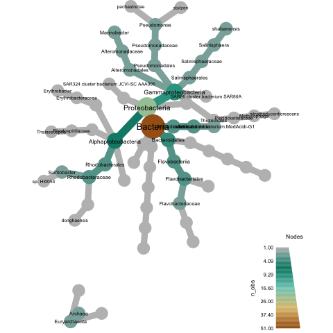

Title: Classifying genome bins using a custom reference database, part II
Date: 2017-09-19
Category: science
Tags: bioinformatics, tara, minhash, ngs, metagenomics, taxonomy
Slug: 2017-classify-genome-bins-with-custom-db-part-2
Authors: C. Titus Brown
Summary: Classifying genome bins with a custom database! Part 2!

Note: this blog post uses a pile of alpha code, which is not systematically tested yet. It will eventually be introduced into [sourmash](https://sourmash.readthedocs.io/en/latest/), probably as `sourmash lca`. I'll put a link to a new tutorial here when that happens.

----

This is Part II of a blog post on some tools to taxonomically classify a set of genome assemblies against a private reference database. [Part I is here](http://ivory.idyll.org/blog/2017-classify-genome-bins-with-custom-db-part-1.html).

The commands below should be a complete walkthrough of the process.

We'll be using data sets from two different binning approaches applied to the Tara ocean data set ([Sunagawa et al., 2015](https://www.ncbi.nlm.nih.gov/pubmed/25999513)). The two approaches were posted to bioRxiv as [Tully et al., 2017](http://www.biorxiv.org/content/early/2017/07/13/162503) and [Delmont et al., 2017](http://www.biorxiv.org/content/early/2017/04/23/129791). Below, I will refer to them as 'Tully' and 'Delmont'.

## Installing sourmash

The below commands use a bunch of commands from the
sourmash Python API, so you'll need to have sourmash installed.  You can do that by following [the beginning of the sourmash tutorial](https://sourmash.readthedocs.io/en/latest/tutorials.html), or, if you are comfortable installing Python packages, you can set up your own virtualenv and go from there using the following commands (which do not require root privileges):

```shell
python3.5 -m venv ~/py3
. ~/py3/bin/activate
pip install -U pip
pip install -U Cython
pip install -U jupyter jupyter_client ipython pandas matplotlib scipy scikit-learn khmer

pip install https://github.com/dib-lab/sourmash/archive/master.zip
```

## Grabbing the 2017-sourmash-lca repository

Most of the scripts below are in the [2017-sourmash-lca](https://github.com/ctb/2017-sourmash-lca) github repository.  So, after changing to a workspace directory, clone the repo:

```shell
git clone https://github.com/ctb/2017-sourmash-lca
```

## Getting the data

I've selected 100 genomes at random from both tully and delmont (although all the commands below should work with the full data sets, too).  Below, we'll grab the data.

```shell
cd 2017-sourmash-lca/
curl -L https://osf.io/73yfz/download?version=1 -o subsample.tar.gz
tar xzf subsample.tar.gz
cd subsample
```

After you get and unpack the data, the command

```shell
ls -FC
```

should show you `delmont/` and `tully/` directories with 100 genomes in each.

## Computing sourmash signatures for your "reference" genomes

Let's use the 'delmont' genomes as the reference genomes, against which you want to classify the 'tully' genomes; for that, we'll have to build a least-common-ancestor database for all the genomes in `delmont/`.

First, we need to compute sourmash signatures for the delmont genomes.
```shell
cd delmont
sourmash compute -k 21,31,51 --scaled 10000 *.fa.gz
```

This will take about 2 minutes.

(Note that `sourmash compute` will autodetect gzipped and bzipped files, as well as straight FASTA or FASTQ - you don't need to name the files in any special way.)

You should now have `.sig` files for every `.fa.gz` file in your `delmont/` directory:
```shell
ls -1 *.fa.gz | wc -l
ls -1 *.sig | wc -l
```
should both yield 100.

These signature files contain the k-mers to which we will link taxonomic information.

## Connecting genome names to NCBI taxonomic IDs

Next, we need to connect each signature to an NCBI taxonomic ID; the next step (Building a least-common-ancestor database) requires a CSV file with the following information:

```
genomename,taxid,lineage
```

here, `genome_name` needs to be the first word (space-separated) of the first contig in each of the genome files above, and `taxid` needs to be the integer taxonomic ID from NCBI -- i.e. the number at the end of [NCBI taxonomy database URLs](https://www.ncbi.nlm.nih.gov/Taxonomy/Browser/wwwtax.cgi?id=99287).  (It doesn't need to be to a specific species or strain, if the species or strain hasn't been entered into the database yet.)

If you're like most bioinformaticians, you've probably developed your own custom way of doing taxonomy, so getting it into proper shape for this step might involve a bit of scripting.

For the Delmont et al. data, the predicted taxonomy of each genome bin is provided in Supplemental Table 3 of [Delmont et al.](http://www.biorxiv.org/content/early/2017/04/23/129791), which I saved as a CSV file [here](https://github.com/ctb/2017-sourmash-lca/blob/master/tara-delmont-SuppTable3.csv). However, we face another problem here, which is that the contigs are named things like `TARA_ANE_MAG_00011_00000000001`, but that's *not* what's in that spreadsheet.  So to connect the spreadsheet to the signatures, we need to "fix" each signature name.

(Where did these names come from? The argument `--name-from-first` to `sourmash compute` tells sourmash to take the name of the signature from the first sequence in the FASTA file.  Hey, it's better than setting it manually for 100 individual files!)

### "Fixing" the names of the signatures

The following Python script will do the trick; it walks through every signature file provided on the command line, and updates the name fields to have the format that's in the spreadsheet.
```python
#! /usr/bin/env python
import sourmash_lib, sourmash_lib.signature
import sys

for filename in sys.argv[1:]:
    print('...', filename)
    outsigs = []
    for sig in sourmash_lib.signature.load_signatures(filename):
        name = sig.d['name'].split('_')[:4]
        sig.d['name'] = "_".join(name)
        outsigs.append(sig)

    with open(filename + '.fixed', 'wt') as fp:
        sourmash_lib.signature.save_signatures(outsigs, fp)
```

This script is available as `delmont-fix-sig-names.py` in the directory above the `delmont` directory, and to run it, execute:
```shell
python ../delmont-fix-sig-names.py *.sig
```

This will produce a bunch of `.sig.fixed` files, and you can rename them to `.sig` by doing the following:
```shell
for i in *.sig
do
    mv $i.fixed $i
done
```

OK! Now we've got the names in our signature files fixed up properly. Next, let's correlate them with the taxonomic IDs published in the paper!

### Running a custom script to get taxids into the spreadsheet.

Next, we need to run the script to produce the CSV file that maps signature names to taxonomic IDs.  This is checked into the [2017-sourmash-lca repository](https://github.com/ctb/2017-sourmash-lca) as script [get_taxid_tara_delmont.py](https://github.com/ctb/2017-sourmash-lca/blob/master/get_taxid_tara_delmont.py).  This script is a hacky mess that searches the downloaded NCBI Files for the names in the spreadsheet, and does some disambiguation if there are duplicate names.

For this, you'll need the `names.dmp` and `nodes.dmp` files from the NCBI taxonomy dump database, so download it, unpack the two files into a subdirectory, and then gzip them so they take up a bit less space.

```shell
cd ../
mkdir db/
cd db/
curl -O -L ftp://ftp.ncbi.nih.gov/pub/taxonomy/taxdump.tar.gz
tar xzf taxdump.tar.gz names.dmp nodes.dmp
gzip names.dmp nodes.dmp
rm taxdump.tar.gz
cd ../
```

You'll also need the taxonomy spreadsheet provided with Delmont et al.; let's put it in the `subsample/` directory above `delmont/`, which should be our current working directory:
```shell
curl -O -L https://github.com/ctb/2017-sourmash-lca/raw/master/tara-delmont-SuppTable3.csv
```

Now, run the script to convert the taxonomy in the
Delmont et al. paper into NCBI taxids:

```shell
python ../get_taxid_tara_delmont.py db/names.dmp.gz db/nodes.dmp.gz \
    tara-delmont-SuppTable3.csv tara_delmont_taxids.csv
```

It will take a few minutes to run, but it should produce a file named `tara_delmont_taxids.csv` that should look preeeeeeetty similar to [the one in github](https://github.com/ctb/2017-sourmash-lca/blob/master/tara_delmont_taxids.csv).  This is the file you'll need for the next step.

## Building a least-common-ancestor database

Now we get to put all this information together!

To build the least-common-ancestor (LCA) database, we'll need to specify:
* a k-mer size (here 21),
* a scaled value (here 10,000 - more on what this does in another blog post),
* the output name of the LCA database (here `delmont.k21.lca`), 
* the taxonomic spreadsheet we just created (`tara_delmont_axids.csv`), 
* the NCBI nodes dump table which we downloaded above (`db/nodes.dmp.gz`), and 
* the signatures -- here, all in the subdirectory `delmont`, and found by specifying `--traverse-directory` (so the extract script will go find all the signatures under `delmont/`.)

Finally, we'll specify an LCA metadata database `delmont.lca.json` that ties together all of the files and k-mer size/scaled values for later use.

To run the extract script that produces the LCA database, then, we have this ungainly command:

```shell
../extract.py -k 21 --scaled 10000 \
    --traverse-directory \
    db/delmont.k21.lca tara_delmont_taxids.csv \
    db/nodes.dmp.gz delmont \
    --lca-json db/delmont.lca.json
```

If that worked without complaint, you should see some output text talking about how it "found root 2431 times".

Run `extract.py` two more times, once for each k-mer value we used in building the signatures above with `sourmash compute` (k=31 and k=51):
```shell
../extract.py -k 31 --scaled 10000 \
    --traverse-directory \
    db/delmont.k31.lca tara_delmont_taxids.csv \
    db/nodes.dmp.gz delmont \
    --lca-json db/delmont.lca.json

../extract.py -k 51 --scaled 10000 \
    --traverse-directory \
    db/delmont.k51.lca tara_delmont_taxids.csv \
    db/nodes.dmp.gz delmont \
    --lca-json db/delmont.lca.json
```

At the end of this, you should have a directory `db/` containing three `*.lca` files, along with `names.dmp.gz` and `nodes.dmp.gz` and two cache files.  You will also have a `delmont.lca.json` file. Collectively, the contents of `db/` are self-contained and can be packaged up and distributed.

## Classifying a collection of genome bins with your newly constructed reference database.

The [original goal](http://ivory.idyll.org/blog/2017-classify-genome-bins-with-custom-db-part-1.html) of this two-part blog post was to be able to classify *new* genome bins against existing private collections of genomes, not just Genbank.  So let's do that!

Let's suppose your new collection of genome bins is in the directory `tully/`.  First, compute signatures for all of them:

```shell
cd tully
sourmash compute -k 21,31,51 --scaled 10000 *.fna.gz
cd ../
```

and now... classify!

To this, we will use the [classify-genome-sigs.py script](https://github.com/ctb/2017-tara-binning/blob/master/classify-genome-sigs.py) that is part of the github.com/ctb/2017-tara-binning repository.  Rather than grabbing that entire repository, let's just download the one script --

```shell
curl -L -O https://github.com/ctb/2017-tara-binning/raw/master/classify-genome-sigs.py
chmod +x classify-genome-sigs.py
mv classify-genome-sigs.py ../
```

and now run it:

```shell
../classify-genome-sigs.py --lca db/delmont.lca.json -k 21 tully
```

This uses our just-created LCA database, `delmont.lca.json`, with a k-mer size of 21, to classify all of the signatures in the `tully/` subdirectory.

You should see the following output:

```
loading LCA database from db/delmont.lca.json
loading taxonomic nodes from: db/nodes.dmp.gz
loading taxonomic names from: db/names.dmp.gz
loading k-mer DB from: delmont.k21.lca
loading all signatures in directory: tully
saving to cache: tully.pickle
...loaded 100 signatures at k=21

classified sourmash signatures in directory: 'tully'
LCA databases used: delmont.lca.json

total signatures found: 100
no classification information: 95

could classify 5
of those, 0 disagree at some rank.

number classified unambiguously, by lowest classification rank:
        class: 3
        family: 1
        genus: 1

disagreements by rank:

classification output as CSV, here: tully.taxonomy.csv
```

which indicates that only 5 out of 100 of the signatures could not be classified, -- more detail on those 5 can be seen by looking in `tully.taxonomy.csv`:

```shell
grep found tully.taxonomy.csv
```

which should yield

```
TOBG_SP-33.fna.gz,2742,found,genus,Bacteria;Proteobacteria;Gammaproteobacteria;Alteromonadales;Alteromonadaceae;Marinobacter
TOBG_EAC-53.fna.gz,246874,found,family,Bacteria;Bacteroidetes;Flavobacteriia;Flavobacteriales;Cryomorphaceae
TOBG_MED-644.fna.gz,28211,found,class,Bacteria;Proteobacteria;Alphaproteobacteria
TOBG_CPC-18.fna.gz,1236,found,class,Bacteria;Proteobacteria;Gammaproteobacteria
TOBG_SP-120.fna.gz,1236,found,class,Bacteria;Proteobacteria;Gammaproteobacteria
```

(You can look at [the first part of this blog post](http://ivory.idyll.org/blog/2017-classify-genome-bins-with-custom-db-part-1.html) to see how to interpret the 3rd column.)

### Using the genbank LCA, too.

We've already prepared the genbank LCA database (which takes about 2 hours total), and you can download it and use it, along with the `delmont` data, to classify the tully sequences; all you need to do is specify multiple lca.json databases on the command line.

To do this, first download and unpack the genbank file:

```shell
curl -L https://osf.io/zfmbd/download?version=1 -o genbank-lca-2017.08.26.tar.gz
cd db/
tar xzf ../genbank-lca-2017.08.26.tar.gz
cd ../
```

and then re-run `classify-genome-sigs.py`:

```shell
../classify-genome-sigs.py \
    --lca db/delmont.lca.json db/genbank.lca.json \
    -k 21 tully
```

-- now you should see that you can classify 56 genomes, 51 of them unambiguously.

### Using other k-mer sizes than 21

Both the genbank LCA database and the one we calculated from Delmont et al. were built for three k-mer sizes: 21, 31, and 51. So you can set the `-k` parameter to any of those, e.g. k=51:
```shell
../classify-genome-sigs.py \
    --lca db/delmont.lca.json db/genbank.lca.json \
    -k 51 tully -o tully-k51.taxonomy.csv
```


## Bonus: plotting your new classification using metacodeR

Let's generate a plot.  I'm going to use
[metacodeR](https://grunwaldlab.github.io/metacoder_documentation/) but Taylor Reiter from our lab [has some other options here](https://taylorreiter.github.io/2017-07-28-Taxonomy-from-Species-Name-in-R/).

Note: you'll need to install metacoder in R for the below to work.

First, generate a classification:

```shell
../classify-genome-sigs.py \
    --lca db/delmont.lca.json db/genbank.lca.json \
    -k 21 tully
```

Grab two scripts, [plot-metacoder.R](https://github.com/ctb/2017-tara-binning/blob/master/plot-metacoder.R) and [load_classify_csv.R](https://github.com/ctb/2017-tara-binning/blob/master/load_classify_csv.R):

```shell
curl -O -L https://github.com/ctb/2017-tara-binning/raw/master/load_classify_csv.R
curl -O -L https://github.com/ctb/2017-tara-binning/raw/master/plot-metacoder.R
```

and now

```shell
Rscript plot-metacoder.R tully.taxonomy.csv tully.pdf
```

should produce a plot entitled 'tully.pdf', which looks like the below:



## Appendix: a recap

To build an LCA database for a private collection of genomes:

1. Compute sourmash signatures for your genomes.
2. Link those signatures to their taxonomic IDs in a CSV file.
3. Run `extract.py` to build the database.

To classify another set of genomes with an LCA database:

1. Compute sourmash signatures for your genomes.
2. Run `classify-genome-sigs.py` on your new signatures, using one or more LCA databases.

----

And that's all, folks!
