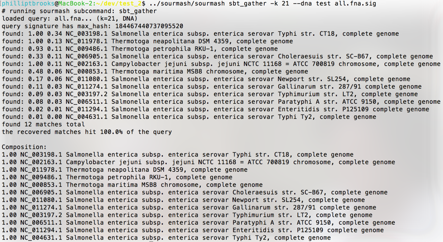

Advancing metagenome classification and comparison by MinHash fingerprinting of IMG/M data sets.
################################################################################################

:author: Phillip T. Brooks, Jiarong Guo, Luiz Irber, C\. Titus Brown
:tags: sourmash, minhash, metagenomics, proposal, grant
:date: 2017-03-01
:slug: 2017-ficus-nersc-jgi-sourmash
:category: science

This is our just-submitted proposal for the `JGI-NERSC "Facilities Integrating Collaborations for User Science" <http://jgi.doe.gov/user-program-info/community-science-program/how-to-propose-a-csp-project/ficus-jgi-nersc/>`__ call. Enjoy!

----

A) Brief description: (Limit 1 page)

Abstract:
Sourmash is a command-line tool and Python library that calculates and compares MinHash signatures from sequence data. Sourmash "compare" and "gather" functionality enables comparison and characterization of signatures. Using sourmash we have calculated and indexed all of the microbial genomes in the NCBI Reference Sequences database and stored them in a searchable Sequence Bloom Tree (SBT). The utility of the SBT is dependent upon the diversity of the sequences used to generate the signatures it contains. We propose calculation of signatures for the approximately 5,200 private microbial genomes and all of private and public metagenomes in the IMG/M database. Genome signatures will be indexed in an SBT and subsequently used to discern the taxonomic breakdown of these metagenomes with sourmash "gather". Because MinHash signatures are one-way and do not include full sample information (e.g. metadata, contigs) they will only be usable to discover relevant samples at JGI, without revealing unpublished information about the samples.

Scope of Work:

We propose to calculate MinHash signatures for all the private genomes in the Integrated Microbial Genomes and Microbiomes (IMG/M) database and to index them in a searchable Sequence Bloom Tree (SBT) for genome comparisons and taxonomic classification using sourmash. We have successfully calculated and indexed signatures for the NCBI Reference Sequences (RefSeq) database and the Sequence Read Archive using sourmash (Brown 2016, Irber 2016) on the Michigan State University High Performance Computer and the Amazon Cloud. We will extend those methods to the approximately 5,200 private genomes in the IMG/M database to increase the number and diversity of the genomes in our publicly available SBT. We request an initial allocation of 50,000 CPU hours for calculation of MinHash signatures for the IMG/M microbial genomes and metagenomes. Calculation of 60,000 microbial genomes for the NCBI RefSeq database took approximately 36 CPU hours, however, time required for calculation of metagenome and classification with "gather" is unknown. Confidential information and full details about private data will remain private, although we do propose to link the signatures to the samples on the JGI Web site so that protected data sets can be accessed appropriately.

B) Background information: (Limit 1 page)

Technical Information:

Data: Non-public collection of microbial genomes (~5,200), and private and public metagenomes (~6,700) in the Integrated Microbial Genomes and Microbiomes (IMG/M) database

Format: fastq/fasta format

Metadata: all metadata recorded, especially taxonomy

Technical Challenges:

We have tested the method (MinHash + SBT) implemented in Sourmash on many public genomes and the basic technical issues have all been resolved. Calculation of signatures is well understood computationally and is roughly linear in the amount of sequence data and only needs to be done once, and we believe that less than 5000 CPU hours will be needed to calculate signatures for 5,000 genomes and less than 50,000 metagenomes. However, we have not yet done all-by-all clustering of metagenomes, which will be considerably more CPU intensive and may present CPU and memory challenges.

MinHash signature calculation is highly parallelizable, since each signature doesn't depend on other datasets. Our experience with calculating signatures from the SRA (streaming data through the network) and RefSeq (reading data from a Lustre filesystem) show that the computation is I/O bound, and uses very low memory. If we have access to NERSC and the data is available locally at Cori we can avoid transferring large volumes of data to other clusters or the cloud, and since the signatures are very small we can transfer only the results.

C) Project Description: (Limit 4 pages)

Description:

We propose to incorporate the Integrated Microbial Genomes and Microbiomes (IMG/M) database's private genome collection into a searchable Sequence Bloom Tree (SBT) index to facilitate taxonomic classification of DNA sequence sets. Reimplementation and adaptation of the MinHash computational method (Broder 1997) allows for compression of DNA sequence into a set of hashes that comprise a signature; this signature can be used for fast and accurate comparison of multiple sequence sets. To date, we have successfully downloaded and calculated signatures for all of the microbial genomes in the NCBI Reference Sequences (RefSeq) database (Brown 2016, Irber 2016). The addition of approximately 5,200 private microbial genome sequences and many metagenomes archived in the IMG/M database to our current index will enhance the utility of the archive and provide a great resource for rapid comparison of DNA sequence data. This should provide a valuable resource to biologists, microbial ecologists, bioinformaticians and others interested in comparative metagenomics and taxonomic classification.

Introduction:

Comparative sequence analysis, be it between genomes or metagenomes (Oulas, Pavloudi et al. 2015) can significantly expand our biological knowledge by letting us ask questions directly of ecosystems and their inhabitants. Advances in sequencing technologies have revolutionized biology by enabling scientists to generate terabytes or more of data for a single experiment. Unlike targeted approaches such as 16S, whole genome sequence comparisons let scientists assess multiple genes simultaneously, and predict the functional repertoire of organisms and/or entire communities in the case of bacteria(Oulas, Pavloudi et al. 2015).

Despite rapid advancements in sequencing technologies over the last decade, many challenges in the analysis of sequence data remain. Sequence data is spread across multiple archives (EMBL, JGI, NCBI), data files are large and not easily downloaded or stored, and options for comparison of multiple sequence files are limited. To address this issue we adapted the MinHash dimensionality reduction technique (Broder 1997) for large scale database search and metagenome taxonomy breakdown in Sourmash (Brown and Irber 2016). Built around the same technology as mash (Ondov, Treangen et al. 2016) Sourmash is a command-line tool and Python library for computing MinHash sketches from DNA sequences, comparing them to each other, plotting comparisons, and breaking metagenomes into their composition in terms of known signatures.

So far we have constructed an SBT from approximately 60,000 microbial genomes in the NCBI RefSeq database and demonstrated the ability to search the SBT yielding matches based upon similarities in signatures. Calculating 60,000 signatures took approximately 36 CPU hours and yielded an uncompressed 1 GB data file. Indexing the signatures in an SBT with the sourmash sbt index function took approximately 5 and ? hours, required 6.5 GB of RAM, and yielded a 3.2 GB index. Searching the index is rapid, requires less than 3 seconds, and requires less than 100 MB of RAM. This SBT is available for download (http://spacegraphcats.ucdavis.edu.s3.amazonaws.com/microbe-sbt-k21-2016-11-27.tar.gz). The SBT is dynamic; new genomes can be added to expand the tree resulting in enhanced searchability.

We have also extended MinHash to support fine-grained resolution of metagenomes (Brooks et al., unpublished).

One of the main uses for the SBT is "gather", an extension of the SBT search that calculates the intersection between the signatures in an SBT and a mixed signature from a metagenome (Figure 1).  This is a mildly novel extension of the MinHash approach for decomposing a metagenome into its constituent known genomes (and estimating the unknown content).

.. figure:: ./images/2017-ficus-fig1.png
   :width: 500px

Figure 1. Representation of sourmash sbt gather functionality. Sourmash SBT gather calculates the intersection between the input (blue circle) and the SBT (green circle). In this case our SBT contains signatures for the all of the microbial genomes in the NCBI RefSeq database. The intersection (blue stars) represents shared hashes between the input and the index resulting in taxonomic classification of organisms represented by the input reads. Yellow and red stars represent unique hashes in the input and SBT respectively.

Utilization:

SBTs containing all of the genomes and metagenomes from the IMG/M database will be used to compare samples with unknown composition to determine similarity and classification. These comparisons will serve multiple purposes including optimization of comparative genomic and metagenomic methods, characterization of samples with unknown composition, and discovery of novel organisms. Implementation of sequence bloom trees in sourmash search and gather facilitate identification and classification against a database of genomes. The output of both SBT functions includes the fraction of the query present in the input and the the ID associated with that genome (Figure 2). Collectively, these functions let us determine if a sequence set is present in a query and also identify the component genomes (i.e. specific species/strains) present in a metagenome.

Figure 2. Sourmash SBT gather output. Sourmash was run on the command line with a kmer size (-k) of 21 for an 12 genome synthetic metagenome. Output include (left to right) genome fraction in the input and taxonomic classification of the match. Default parameters compare the input to the index and discard hashes when a match is found. All matches are compared to the original index to determine the fraction of the genome present in the input.

MinHashing sequence data for "gather" functionality reduces the dataset by a constant size (approximately 10,000-100,000-fold) (Ondov, Treangen et al. 2016). Using this technique complex communities such as soil metagenomes can be compared and taxonomically classified without assembly. MinHashing the genomes in IMG/M, especially those from underexplored branches in the tree of life such as those from JGI's Genomic Encyclopedia of Bacteria and Archaea (GEBA) will enrich the current index of genomes and improve the taxonomic analysis capabilities of sourmash; here note that sourmash signatures can also be converted to mash signatures without loss, using a newly evolved standard format, so the fruits of this project will be usable well beyond our software.

Since calculating MinHash signatures produces an irreversible summary of the data set, they do not compromise the content of protected data sets. Thus we will make data searchable without revealing the entire dataset's content publicly. We will provide a link in the signatures to the data source in JGI that would require users of Sourmash to login to JGI IMG/M to access the whole dataset. Our proposal would connect to a broader community of researchers potentially interested in those private datasets with JGI, and should encourage new collaborations and increased use of/access to JGI resources.

In addition to indexing genomic datasets for taxonomic analysis, Sourmash can also index transcriptomic, metagenomic or metatranscriptomic datasets for comparative analysis. Thus it has the potential to be a one-stop-shop for searching all archives include SRA, ENA, and IMG/M while preserving data privacy as mentioned above. Towards this end we intend to index all of metagenomic datasets in the IMG/M database, determine the taxonomic breakdown of these genomes with "gather", and make this data available in a public data set with links to JGI resources. We have also developed a decentralized system for SBT storage and MinHash signatures sharing using IPFS (InterPlanetary File System) and calculated MinHash signatures for all of the WGS microbial sequences in the SRA(Brown 2016, Irber 2016).

The Lab for Data Intensive Biology at UC Davis is uniquely well suited for this project. We have demonstrated the ability to achieve similar goals with the NCBI Refseq database. Furthermore, the Lab for Data Intensive Biology practices open science, and is actively engaging the community in the development of software, as can be seen in Sourmash, so we expect community contributions to be stimulated by this proposal.

Community Interest:

A number of scientific communities will benefit from this project. Currently, we lack means for fast, accurate, and lightweight comparative analysis of metagenomes. We expect that these indexes will lead to the development of new technologies that take advantage of the MinHash dimensionality reduction technique and the SBT for comparative sequence analysis. Blog posts regarding the RefSeq index and results from Sourmash have generated comments from many scientists in the field and spurred contributions to the development of Sourmash, which is publicly available on GitHub.

DOE mission:

Our proposal directly addresses the overall mission of the Joint Genome Institute by optimizing methodology required for the analysis of Bioenergy, carbon cycle, and biogeochemistry relevant data sets. The products of our proposal will add approximately 5,200 microbial genomes - many novel - to a public database. Subsequently, we will use this SBT to characterize the metagenomes from IMG/M with SBT gather. This substantial addition will enable researchers to enrich the data and conclusions they are able to draw from their sequencing efforts. Preliminary data for this proposal has enabled researchers including ourselves to explore hypotheses in environmentally relevant metagenomes. Applications of sequence comparison directly relevant to the DOE mission include assessing the impacts of heavy metals (Algora, Vasileiadis et al. 2015), natural disasters (Hiraoka, Machiyama et al. 2016), climate change (Hultman, Waldrop et al. 2015), and crops (Jesus, Liang et al. 2016) on microbial communities. In accordance with the mission of the DOE, and in collaboration with Jiarong Guo and Jim Tiedje, we have begun the analysis of sequence data from 3 biofuel crops -- corn, switchgrass, and Miscanthus. These data are part of one of the largest metagenome sequencing projects to date (4.5 trillion base pairs of sequence). Sourmash will enable fast composition analysis and comparison of these large metagenomic samples. Note that breadth of genomes included in our database is critical for this analysis.

We have demonstrated that MinHashing facilitates taxonomic classification of novel metagenomes by identifying the intersection between signatures from novel datasets and those contained in the index. The addition of non-public genomes from the IMG/M database will enrich our index and facilitate the identification of previously unidentifiable organisms in DNA sequence sets.

D) References: (No page limit)

Algora, C., S. Vasileiadis, K. Wasmund, M. Trevisan, M. Kr"ger, E. Puglisi and L. Adrian (2015). "Manganese and iron as structuring parameters of microbial communities in Arctic marine sediments from the Baffin Bay." FEMS Microbiol Ecol 91(6).

Broder, A. Z. (1997). On the resemblance and containment of documents. Proceedings.

Brown, C. T. (2016). "Categorizing 400,000 microbial genome shotgun datasets from the SRA."  http://ivory.idyll.org/blog/tag/sourmash.html.

Brown, C. T. (2016). "Quickly searching all of the microbial genomes, mark 2 - now with archaea, phage, fungi, and protists!"  http://ivory.idyll.org/blog/2016-sourmash-sbt-more.html.

Brown, C. T. and L. Irber (2016). sourmash: a library for MinHash sketching of DNA, The Journal of Open Science.

Hiraoka, S., A. Machiyama, M. Ijichi, K. Inoue, K. Oshima, M. Hattori, S. Yoshizawa, K. Kogure and W. Iwasaki (2016). "Genomic and metagenomic analysis of microbes in a soil environment affected by the 2011 Great East Japan Earthquake tsunami." BMC Genomics 17: 53.

Hultman, J., M. P. Waldrop, R. Mackelprang, M. M. David, J. McFarland, S. J. Blazewicz, J. Harden, M. R. Turetsky, A. D.
McGuire, M. B. Shah, N. C. VerBerkmoes, L. H. Lee, K. Mavrommatis and J. K. Jansson (2015). "Multi-omics of permafrost, active layer and thermokarst bog soil microbiomes." Nature 521(7551): 208-212.

Irber, L. (2016). "Minhashing all the things (part 1): microbial genomes."  http://blog.luizirber.org/2016/12/28/soursigs-arch-1/.

Jesus, E. d. C., C. Liang, J. F. Quensen, E. Susilawati, R. D. Jackson, T. C. Balser and J. M. Tiedje (2016). "Influence of corn, switchgrass, and prairie cropping systems on soil microbial communities in the upper Midwest of the United States." GCB Bioenergy 8(2): 481--494.

Ondov, B. D., T. J. Treangen, P. Melsted, A. B. Mallonee, N. H. Bergman, S. Koren and A. M. Phillippy (2016). "Mash: fast genome and metagenome distance estimation using MinHash." Genome Biol 17(1): 132.

Oulas, A., C. Pavloudi, P. Polymenakou, G. A. Pavlopoulos, N. Papanikolaou, G. Kotoulas, C. Arvanitidis and I. Iliopoulos (2015). "Metagenomics: tools and insights for analyzing next-generation sequencing data derived from biodiversity studies." Bioinform Biol Insights 9: 75-88.
