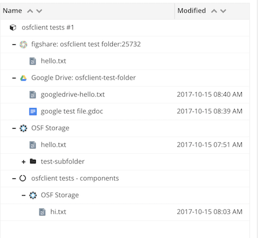

Title: A brief introduction to osfclient, a command line client for the Open Science Framework
Date: 2017-10-16
Category: science
Tags: osf, osfclient
Slug: 2017-introducing-osfclient
Authors: C. Titus Brown
Summary: Introducing osfclient!

Over the last few months, [Tim Head](https://twitter.com/betatim) has been pushing forward the [osfclient project](https://github.com/dib-lab/osf-cli/), an effort to build a simple and friendly command-line interface to the [Open Science Framework's](http://cos.io) [file storage](http://ivory.idyll.org/blog/2017-osf-for-files.html).  This project was funded by a gift to my lab through the [Center for Open Science (COS)](http://cos.io) to the tune of about $20k, given by an anonymous donor.

The original project was actually to [write an OSF integration for Galaxy](http://ivory.idyll.org/blog/2015-osf-galaxy-dibs-funding.html), but that project was first delayed by my move to UC Davis and then suffered from [Michael Crusoe's](https://twitter.com/biocrusoe?lang=en) move to work on the [Common Workflow Language](https://github.com/common-workflow-language/common-workflow-language). After talking with the COS folk, we decided to repurpose the money to something that addresses a need in my lab - [using the Open Science Framework to share files](http://ivory.idyll.org/blog/2017-osf-for-files.html).

Our (Tim's) integration effort resulted in [osfclient](osfclient.readthedocs.io/en/stable), a combination Python API and command-line program.  The project is still in its early stages, but a few people have found it useful - in addition to increasing usage within my lab, [@zkamvar has used it to transfer "tens of thousands of files"](https://twitter.com/ZKamvar/status/917114608447565831), and [@danudwary found it "just worked"](https://twitter.com/ctitusbrown/status/907636578897477634) for grabbing some big files. And new detailed use cases [are emerging regularly](https://twitter.com/o_guest/status/919232244992172032).

Most exciting of all, we've had contributions from a number of other people
already, and I'm looking forward to this project growing to meet the needs
of the open science community!

## Taking a step back: why OSF, and why a command-line client?

I talked a bit about "why OSF?" in a [previous blog post](http://ivory.idyll.org/blog/2017-osf-for-files.html), but the short version is that it's a globally accessible place to store files for science, and it works well for that! It fits a niche that we haven't found any other solutions for - free storage for medium size genomics files - and we're actively exploring its use in about a dozen different projects.

Our underlying motivations for building a **command-line client** for OSF were several:

* we often need to retrieve full folder/directory hierarchies of files for research and training purposes;

* frequently, we want to retrieve those file hierarchies on remote (cloud or HPC) systems;

* we're often grabbing files that are larger than GitHub supports;

* sometimes these files are from private projects that we cannot (or don't want to) publicize;

Here, the Open Science Framework was already an 80% solution (supporting folder hierarchies, large file storage, and a robust permissions system), but it didn't have a command-line client - we were reduced to using `curl` or `wget` on individual files, or (in theory) writing our own REST queries.

Enter `osfclient`!

## Using osfclient, a quickstart

(See "Troubleshooting osfclient installs" at the bottom if you run into any troubles running these commands!)

In a Python 3 environment, do:

```
pip install osfclient
```

and then execute:

```
osf -p fuqsk clone
```

This will go to the [osfclient test project](https://osf.io/fuqsk/) on [http://osf.io](http://osf.io), and download all the files that are part of that project -- if you execute:
```
find fuqsk
```

you should see:

```
fuqsk
fuqsk/figshare
fuqsk/figshare/this is a test text file
fuqsk/figshare/this is a test text file/hello.txt
fuqsk/googledrive
fuqsk/googledrive/google test file.gdoc
fuqsk/googledrive/googledrive-hello.txt
fuqsk/osfstorage
fuqsk/osfstorage/hello.txt
fuqsk/osfstorage/test-subfolder
fuqsk/osfstorage/test-subfolder/hello-from-subfolder.txt
```

which showcases a particularly nice feature of the OSF that I'll talk about below.

## A basic overview of what osfclient did

If you go to the project URL, [http://osf.io/fuqsk](http://osf.io/fuqsk), you will see a file storage hierarchy that looks like so:



What osfclient is doing is grabbing all of the different storage files and downloading them to your local machine. Et voila!

## What's with the 'figshare' and 'googledrive' stuff? Introducing add-ons/integrations.

In the above, you'll notice that there are these  subdirectories named `figshare` and `googledrive`. What are those?

The Open Science Framework can act as an umbrella integration for a variety of external storage services - [see the docs](http://help.osf.io/m/addons/l/524149-storage-add-ons).  They support Amazon S3, Dropbox, Google Drive, Figshare, and a bunch of others.

In the above project, I linked in my Google Drive and Figshare accounts to OSF, and connected specific remote folders/projects into the OSF project ([this one](https://drive.google.com/drive/u/0/folders/0B7cOEBWnXSBiSEV0WUlxVUdKdkE) from Google Drive, and [this one](https://figshare.com/account/home#/projects/25732) from figshare).  This allows me (and others with permissions on the project) to access and manage those files from within a single Web UI on the OSF.

`osfclient` understands some of these integrations (and it's [pretty trivial to add a new one to the client, at least](https://github.com/dib-lab/osf-cli/pull/100/files)), and it does the most obvious thing possible with them when you do a `osfclient clone`: it grabs the files and downloads them!  (It should also be able to push to those remote storages, but I haven't tested that today.)

Interestingly, this appears to be a good simple way to layer OSF's project hierarchy and permission system on top of more complex and/or less flexible and/or non-command-line-friendly systems.  For example, [Luiz Irber](http://luizirber.org) recently uploaded a very large file to google drive via [rclone](https://rclone.org/) and it showed up in his OSF project just fine.

This reasonably flexible imposition of an overall namespace on a disparate collection of storages is pretty nice, and could be a real benefit for large, complex projects.

## Other things you can do with `osfclient`

`osfclient` also has file listing and file upload functionality, along with some configurability in terms of providing a default project and permissions within specific directories.  The osfclient [User Guide](https://osfclient.readthedocs.io/en/stable/cli-usage.html) has some brief instructions along these lines.

`osfclient` also contains a Python API for OSF, and you can see a bit more about that [here](https://osf.io/tx8p9/), in Tim Head and Erin Braswell's webinar materials.

## What's next?

There are a few inconveniences about the OSF that could usefully be worked around, and a lot of features to be added in `osfclient`.  In no particular order, here are a few of the big ones that require significant refactoring or design decisions or even new REST API functionality on the OSF side --

* we want to make `osf` behave a bit more like `git` - see [the issue](https://github.com/dib-lab/osf-cli/issues/123).  This would make it easier to teach and use, we think. In particular we want to avoid having to specify the project name every time.
* speaking of project names, I don't think the project UIDs on the OSF (`fuqsk` above) are particular intuitive or type-able, and it would be great to have a command line way of discovering the project UID for your project of interest.
* I'd also like to add project creation and maybe removal via the command line, as well as project registration - more on that later.
* the file storage hierarchy above, with `osfstorage/` and `figshare/` as top level directories, isn't wonderful for command line folk - there are seemingly needless hierarchies in there.  I'm not sure how to deal with this but there are a couple of possible solutions, including adding a per-project 'remapping' configuration that would move the files around.

## Concluding thoughts

The OSF offers a simple, free, Web friendly, and convenient way to privately and publicly store collections of files under 5 GB in size on a Web site.  `osfclient` provides a simple and reasonably functional way to download files from and upload files to the OSF via the command line. Give it a try!

## Appendix: Troubleshooting osfclient installs

1. If you can't run `pip install` on your system, you may need to either run the command as root, OR establish a virtual environment -- something like 

   ```
   python -m virtualenv -p python3.5 osftest
   . osftest/bin/activate
   pip install osfclient
   ```

   will create a virtualenv, activate it, and install osfclient. (If you run into problems)

2. If you get a `requests.exceptions.SSLError`, you may be on a Mac and using an old version of openssl. You can try `pip install -U pyopenssl`.  If that doesn't work, [please add a comment to this issue](https://github.com/dib-lab/osf-cli/issues/74).

3. Note that a conda install for osfclient exists, and you should be able to do `conda install -c conda-forge osfclient`.
