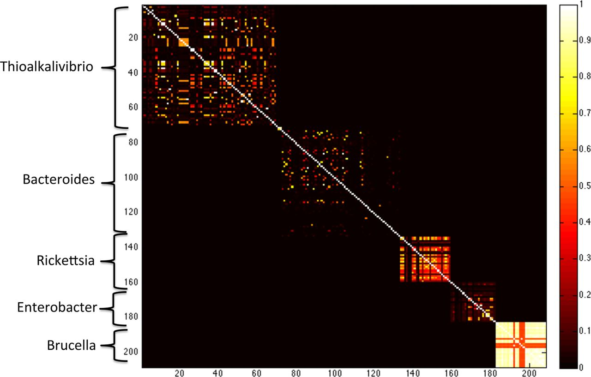
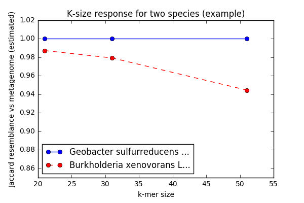
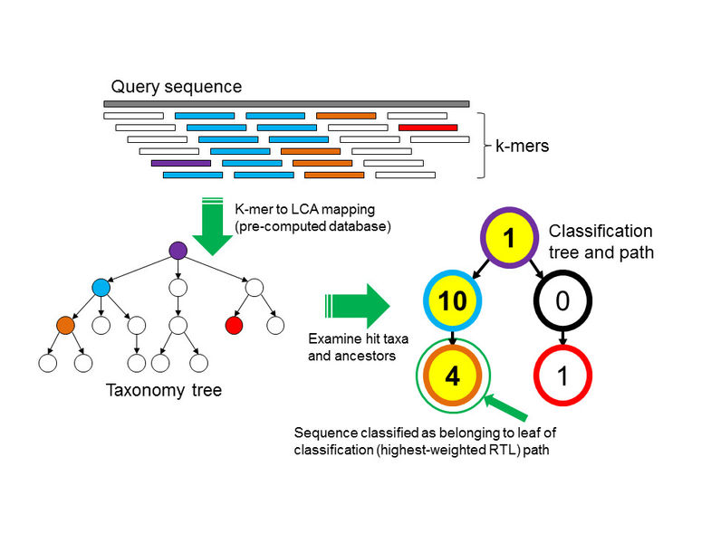

Title: A post about k-mers - this time for taxonomy!
Date: 2017-08-30 11:25
Category: science
Tags: k-mer,minhash,taxonomy,ngs,metagenomics
Slug: 2017-something-about-kmers
Authors: C. Titus Brown
Summary: A brief literature review: MetaPalette, mash/MinHash, and Kraken.

I love k-mers. Unlike software engineering or metagenomics, this isn't a love-hate relationship - this is a pure "gosh aren't they wonderful" kind of love and admiration.  They "just work" in so many situations that it helps validate the last 10 years of my research life (which, let's be honest, has been pretty k-mer focused!).

DNA k-mers underlie much of our assembly work, and we (along with many others!) have spent a lot of time thinking about how to [store k-mer graphs efficiently](http://www.pnas.org/content/109/33/13272), [discard redundant data](http://ivory.idyll.org/blog/what-is-diginorm.html), and [count them efficiently](http://journals.plos.org/plosone/article?id=10.1371/journal.pone.0101271).

More recently, we've been enthused about [using k-mer based similarity measures](http://joss.theoj.org/papers/3d793c6e7db683bee7c03377a4a7f3c9) and [computing and searching k-mer-based sketch search databases for all the things](http://ivory.idyll.org/blog/2016-sourmash-sbt.html).

But I haven't spent too much talking about using k-mers for taxonomy, although that has become an *ahem* area of interest recently, [if you read into our papers a bit](http://www.biorxiv.org/content/early/2017/07/03/155358).

In this blog post I'm going to fix this by doing a little bit of a literature review and waxing enthusiastic about other people's work. Then in a future blog post I'll talk about how we're building off of this work in fun! and interesting? ways!

## A brief introduction to k-mers

(Borrowed from [the ANGUS 2017 sourmash tutorial](https://github.com/ngs-docs/angus/blob/2017/kmers-and-sourmash.md)!)

K-mers are a fairly simple concept that turn out to be tremendously powerful.

A "k-mer" is a word of DNA that is k long:

```
ATTG - a 4-mer
ATGGAC - a 6-mer
```

Typically we extract k-mers from genomic assemblies or read data sets by running a k-length window across all of the reads and sequences -- e.g. given a sequence of length 16, you could extract 11 k-mers of length six from it like so:

```
AGGATGAGACAGATAG
```
becomes the following set of 6-mers:
```
AGGATG
 GGATGA
  GATGAG
   ATGAGA
    TGAGAC
     GAGACA
      AGACAG
       GACAGA
        ACAGAT
         CAGATA
          AGATAG
```

k-mers are most useful when they're *long*, because then they're *specific*. That is, if you have a 31-mer taken from a human genome, it's pretty unlikely that another genome has that exact 31-mer in it.  (You can calculate the probability if you assume genomes are random: there are 4<sup>31</sup> possible 31-mers, and 4<sup>31</sup> = 4,611,686,018,427,387,904.  So, you know, a lot.)

The important concept here is that **long k-mers are species specific**. We'll go into a bit more detail later.

## K-mers and assembly graphs

We've already run into k-mers before, as it turns out - when we were doing [genome assembly](genome-assembly.html).  One of the three major ways that genome assembly works is by taking reads, breaking them into k-mers, and then "walking" from one k-mer to the next to bridge between reads.  To see how this works, let's take the 16-base sequence above, and add another overlapping sequence:
    
```
AGGATGAGACAGATAG
    TGAGACAGATAGGATTGC
```

One way to assemble these together is to break them down into k-mers -- e.g the sequences above becomes the following set of 6-mers:
```
AGGATG
 GGATGA
  GATGAG
   ATGAGA
    TGAGAC
     GAGACA
      AGACAG
       GACAGA
        ACAGAT
         CAGATA
          AGATAG -> off the end of the first sequence
           GATAGG <- beginning of the second sequence
            ATAGGA
             TAGGAT
              AGGATT
               GGATTG
                GATTGC
```

and if you walk from one 6-mer to the next based on 5-mer overlap, you get the assembled sequence:

```
AGGATGAGACAGATAGGATTGC
```
voila, an assembly!

Graphs of many k-mers together are called De Bruijn graphs, and assemblers like MEGAHIT and SOAPdenovo are De Bruijn graph assemblers - they use k-mers underneath.

### Why k-mers, though? Why not just work with the full read sequences?

Computers *love* k-mers because there's no ambiguity in matching them. You either have an exact match, or you don't.  And computers love that sort of thing!

Basically, it's really easy for a computer to tell if two reads share a k-mer, and it's pretty easy for a computer to store all the k-mers that it sees in a pile of reads or in a genome.

So! On to some papers!

## MetaPalette

About a year and a half ago, I had the pleasure of reviewing [the MetaPalette paper](http://msystems.asm.org/content/1/3/e00020-16) by David Koslicki and Daniel Falush.  This paper did some really cool things and I'm going to focus on two of the least cool things (the cooler things are deeper and worth exploring, but mathematical enough that I haven't fully understood them).

The first cool thing: the authors show that k-mer similarity between genomes at different k approximates various degrees of taxonomic similarity. Roughly, high similarity at k=21 defines genus-level similarity, k=31 defines species-level, and k=51 defines strain-level.  (This is an ad-lib from what is much more precisely and carefully stated within the paper.)  This relationship is something that we already sorta knew from [Kraken](ccb.jhu.edu/software/kraken/MANUAL.html) and similar k-mer-based taxonomic efforts, but the MetaPalette paper was the first paper I remember reading where the specifics really stuck to me.



This figure, taken from [the MetaPalette paper](http://msystems.asm.org/content/1/3/e00020-16), shows clearly how overall k-mer similarity between pairs of genomes matches the overall structure of genera.

----

The second cool thing: the authors show that you can look at what I think of as the "k-mer size response curve" to infer the presence of strain/species variants of known species in a metagenomic data set. Briefly, in a metagenomic data set you would expect to see stronger similarity to a known genome at k=21 than at k=31, and k=31 than at k=51, if a  variant of that known species is present. (You'd see more or less even similarity across the k-mer sizes if the exact genome was present.)



In this figure (generated by code from [our metagenome assembly preprint](www.biorxiv.org/content/early/2017/07/03/155358)), you can see that this specific Geobacter genome's inclusion in the metagenome stays the same as we increase the k-mer size, while Burkholderia's decreases. This suggests that we know precisely which Geobacter is present, while only a strain variant of that Burkholderia is present.

I'm not sure whether this idea has been so clearly explicated before MetaPalette - it may not be novel because it sort of falls out of De Bruijn/assembly graph concepts, for example - but again it was really nicely explained in the paper, and the paper did an excellent job of then using these two observations to build a strain-aware taxonomic classification approach for metagenomic data sets.

The two major *drawbacks* of MetaPalette were that the implementation (though competitive with other implementations) was quite heavyweight and couldn't run on e.g. my laptop; and the math was complicated enough that reimplementing it myself was not straightforward.

## MinHash and mash

(This next paper is less immediately relevant to taxonomy, but we'll get there, promise!)

At around the same time as I reviewed the MetaPalette paper, I *also* reviewed the [mash paper](https://genomebiology.biomedcentral.com/articles/10.1186/s13059-016-0997-x) by Ondov et al., from Adam Phillipy's lab.  (Actually, what *really* happened was two people from my lab reviewed it and I blessed their review & submitted it, and then when the revisions came through I read the paper more thoroughly & got into the details to the point where [I reimplemented it for fun](http://ivory.idyll.org/blog/2016-sourmash.html). My favorite kind of review!)

The mash paper showed how a simple technique for fast comparison of sets, called [MinHash](https://en.wikipedia.org/wiki/MinHash) - published in 1998 by Broder - could be applied to sets of k-mers. The specific uses were things like comparing two genomes, or two metagenomes.  The mash authors also linked the Jaccard set similarity measure to the better known (in genomics) measure, the Average Nucleotide Identity between two samples.

The core idea of MinHash is that you subsample any set of k-mers in the same way, by first establishing a common permutations of k-mer space (using a hash function) and then subselecting from that permutation in a systematic way, e.g. by taking the lowest N hashes.  This lets you *prepare* a subsample from a collection of k-mers *once*, and then forever more use that same subsampled collection of k-mers to compare with other subsampled collections. (In sourmash, we call these subsampled sets of k-mers "signatures".)

What really blew my mind was how *fast* and *lightweight* MinHash was, and how broadly applicable it was to various problems we were working on. The mash paper started what is now an 18 month odyssey that has led in some pretty interesting directions.  (Read [here](http://ivory.idyll.org/blog/2017-sourmash-sra-microbial-wgs.html) and [here](http://ivory.idyll.org/blog/2017-ficus-nersc-jgi-sourmash.html) for some of them.)

The one big drawback of mash/MinHash for me stems from its strength: MinHash has limited resolution when comparing two sets of very different sizes, e.g. a genome and a metagenome.  The standard MinHash approach *assumes* that the sets to be compared are of similar sizes, and that you are calculating Jaccard similarity across the entire set; in return for these assumptions, you get a fixed-size sketch with guarantees on memory usage and execution time for both preparation and comparisons.  However, these assumptions prevent something I want to do very much, which is to compare complex environmental metagenomes with potential constituent genomes.

# A blast from the recent past: Kraken

The third paper I wanted to talk about is Kraken, a metagenome taxonomic classifier by Wood and Salzberg (2014) - see [manual](http://ccb.jhu.edu/software/kraken/MANUAL.html), and [paper](https://genomebiology.biomedcentral.com/articles/10.1186/gb-2014-15-3-r46).  This is actually a somewhat older paper, and the reason I dug back into the literature is that there has been somewhat of a renaissance in k-mer classification systems as the CS crowd has discovered that storing and searching large collections of k-mers is an interesting challenge. More specifically, I've recently reviewed several papers that implement variations on the Kraken approach (most recently [MetaOthello](https://academic.oup.com/bioinformatics/article-abstract/doi/10.1093/bioinformatics/btx432/3931858/A-novel-data-structure-to-support-ultra-fast?redirectedFrom=fulltext), by Liu et al (2017)). My lab has also been getting more and more office hour requests from people who want to use Kraken and [Kaiju](http://kaiju.binf.ku.dk/) for metagenomic classification.

Briefly, Kraken uses k-mers to apply the least-common-ancestor approach to taxonomic classification.  The Kraken database is built by linking every known k-mer to a taxonomic ID.  In cases where a k-mer belongs to only a single known genome, the assignment is easy: that k-mer gets the taxonomic ID of its parent genome. In the fairly common case that a k-mer belongs to multiple genomes, you assign the taxonomic ID of the least-common-ancestor taxonomic level to that k-mer.

Then, once you have built the database, you classify sequences by looking at the taxonomic IDs of constitutent k-mers.  Conveniently this step is *blazingly* fast!



This figure (from [Wood and Salzberg, 2014](https://genomebiology.biomedcentral.com/articles/10.1186/gb-2014-15-3-r46)) shows the process that Kraken uses to do taxonomic identification.  It's fast because (once you've computed the k-mer-to-LCA mapping) k-mer looks up are super fast, albeit rather memory intensive.

What you end up with (when using Kraken) is a taxonomic ID for each read, which can then be post-processed with something like [Bracken (Lu et al., 2017)](https://peerj.com/articles/cs-104/) to give you an estimated species abundance.

The drawback to Kraken (and many similar approaches) is shared by MetaPalette: the databases are large, and building the databases is time/CPU-intensive.  In our experience we're seeing what [the manual](http://ccb.jhu.edu/software/kraken/MANUAL.html) says: you need 30+ GB RAM to run the software, and many more to build the databases.

(At the end of the day, it may be that many people actually want to use something like [Centrifuge](https://ccb.jhu.edu/software/centrifuge/manual.shtml), another tool from the inimitable Salzberg group (see [Kim et al., 2016](http://genome.cshlp.org/content/early/2016/11/16/gr.210641.116.abstract)).  I'm only slowly developing a deeper understanding of the opportunities, limitations, and challenges of the various approaches, and I may blog about that later, but for now let's just say that I have some reasons to prefer the Kraken-style approach.)

# More general thoughts

There are a number of challenges that are poorly addressed by current k-mer based classification schemes. One is scalability of classification: I really want to be able to run this stuff on my laptop! Another is scalability of the database build step: I'm OK with running that on bigger hardware than my laptop, but I want to be able to update, recombine, and customize the databases. Here, large RAM requirements are a big problem, and the tooling for database building is rather frustrating as well - more on that below.

I also very much want a *library* implementation of these things - specifically, a library in *Python*. Basically, you lose a lot when you communicate between programs through files. (See [this blog post](http://ivory.idyll.org/blog/2015-bioinformatics-middle-class.html) for the more general argument.) This would let us intermix k-mer classification with other neat techniques.

More generally, in the current era of "sequence all the things" and the coming era of "ohmigod we have sequenced *so many things* now what" we are going to be in need of a rich, flexible ecosystem of *tools* and *libraries*.  This ecosystem will (IMO) need to be:

* decentralized and locally installable & usable, because many labs will have large internal private data sets that they want to explore;
* scalable in memory and speed, because the sheer volume of the data is so ...voluminous;
* customizable and programmable (see above) so that we can try out cool new ideas more easily;
* making use of databases that can be incrementally (and routinely) updated, so that we can quickly add new reference information without rebuilding the whole database;

and probably some other things I'm not thinking of. The ecosystem aspect here is increasingly important and something I've been increasingly focusing on: approaches that don't work together well are simply not that useful.

Another goal we are going to need to address is *classification and characterization of unknowns* in metagenomic studies. We are making decent progress in certain areas (metagenome-resolved genomics!!) but there are disturbing hints that we largely acting like [drunks looking for their keys under the streetlight](https://en.wikipedia.org/wiki/Streetlight_effect). I believe that we remain in need of systematic, scalable, comprehensive approaches for characterizing environmental metagenome data sets.

This means that we will need to be thinking more and more about reference independent analyses.  Of the three above papers, only mash is reference independent; MetaPalette and Kraken both rely on reference databases. Of course, those two tools address the flip side of the coin, which is to properly make use of the reference databases we *do* have for pre-screening and cross-validation.

--titus
