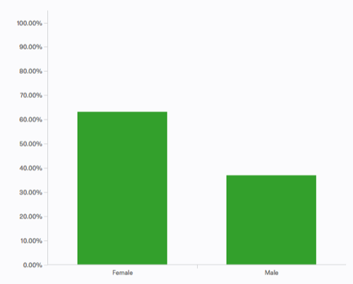

Title: Assessment report for ANGUS 2017
Date: 2018-02-27
Category: training
Tags: angus,ngs,dibsi
Slug: 2018-dibsi-2017-assessment
Authors: Karen R. Word
Summary: An assessment report on ANGUS 2017.

**Note: This is an invited blog post by Dr. Karen Word on our [2017 sequence
analysis workshop, ANGUS](http://ivory.idyll.org/dibsi/2017/).  Our
[2018 schedule](http://ivory.idyll.org/dibsi/) has now been posted!**

# DIBSI Assessment: preliminary ANGUS report

There are two sorts of stories I find myself telling based on my own experience talking to people & reading through things: 

1) This workshop catered to learners of many abilities, and no group
was categorically dissatisfied. Satisfaction for these different
groups was based on different outcomes, e.g. for novices building a
mental model & confidence was considered success; for practitioners
validating practices and acquiring new tools, tricks, and contacts was
more likely to constitute success.

2) From our perspective, a desirable outcome would be the creation of
a community within which learners can support each other in solving
problems to minimize the strain on experts. Learners largely did not
seem to be seeking this kind of community -- even where they valued
socialization, it was rarely with an eye towards technical
support. The exception seemed to be active practitioners who had
already been seeking support within their own community and were able
to understand other learners as a resource for help.

### Basic demographics:

Note: demographics were collected in the pre-assessment only. Individuals who did not take the pre-assessment are not represented here.

The "other" category above was selected mainly by postdocs, but also
includes DVM, MD, BS-holding professional, and one "Assistant
professor." This is a similar mixture as those cited under
"PhD-holding professional" hence with few exceptions these categories
could be combined (yellow & green) indicating similar representation
of advanced degree-holders relative to graduate students.

### A few response summaries:

People were overwhelmingly satisfied with the workshop:

Curiously, even learners who indicated that they left with "no
ability" to install and run genome assembly software still largely
felt that their needs had been met:

Other metrics are similarly supportive. 89% of respondants indicated
that they learned what they hoped to learn, and 96% say they would
recommend the workshop to colleagues.

We asked two open-response content questions on the pre- and post-assessments. One of them was as follows:

> Suppose that you are using Illumina to sequence DNA from a mouse
> sample that should have genetic differences from the mouse reference
> genome. Discuss one or more approaches you would take to analyze the
> data, as well as your expected sensitivity to SNPs and
> indels. Include in your discussion how much you will miss, and how
> much you find that will be wrong.

This word cloud shows the most common terms from pre-assesment
responses to the question above, scrubbed of most terminology present
in the question:

vs. Post-assessment responses to same, reflecting common details acquired:

The figure below shows pre vs. post self-evaluation of ability in
various relevant subject areas. Substantial changes are evident in all
categories except Python programming, a skill that is not directly
taught in the workshop.

The figure below shows more specific responses to "I know how to" or
"I understand" questions on a Likert-type scale. Progress is evident
in all categories, again with python scripting ("Qscriptpy") taking up
the rear. The greatest progress is in knowing what relevant tools do.

### A few quotes:

In response to "please comment on the extent to which you learned what you expected to learn":

Success as defined by a learner who does not plan to analyze their own data:

> 1 . I wanted to understand the generic pipeline for analyzing RNA
> sequencing data- SUCCESS 2. I wanted to learn the fundamental skills
> needed to use tools in the shell/R- SUCCESS 3. I wanted to feel
> comfortable talking with bioinformaticists about how they performed
> analyses, so I can be sure that they did what I need them to do-
> SUCCESS Additionally, I received a great introduction to the
> concepts of "open science" and "making stuff actually reproducible,"
> things which are not emphasized in my program!

Success for learner who has data that have previously been analyzed, but wants to become more independent: 

> I came with zero to none programming skills and had no idea how to
> get started with analyzing next-gen sequencing data. I was sitting
> on RNA-Seq datasets that someone else had analyzed for me and felt
> so powerless and overwhelmed. Since attending the workshop, I was
> able to get my own Jetstream allocation, move my data into the new
> server, do genome assembly --> Diff gene expression all on my own,
> while generating more than decent plots using R. I feel immensely
> relieved that I have all the basic resources I need to get started
> on exploring Bioinformatics and all the possible research directions
> that can open up as a result of this. I also met some freaking
> awesome people, helping build a network of skilled Bioinformaticians
> I can reach out to if I ever need advice/help. For someone coming
> from an obscure univ which doesn't have any bioinformaticians at
> all, this is huge. Thank you DIBSI organizers!!

Another learner who wants to analyze their own data and came in with some computational skill:

> I work with non model organism and this workshop turned out to be
> great to answer my queries and how to tackle genome and rna seq data
> analysis of such organisms. Also, the knowledge of tools used would
> further help me perform assembly and analysis of my own data set. I
> feel way more confident in running the tools for analysis after
> participating in this workshop

In response to "Please comment on how your understanding of computational science changed":

The perspective of an advanced learner:

> This workshop pushed me from being an adequate programmer who can
> google things and piece together a decent pipeline to get the
> necessary data, to understanding what's going on under the hood at
> each step and analyze data quality much better.

And another:

> I had some prior experience of bioinformatics tools used to analysis
> rna seq and DNA seq data, but this workshop further helped me with
> understanding new tools such as R studio , markdown and writing own
> scripts.

Whereas from people reporting lower computational skills, one benefit
was gaining focus on what was important or learning what they did
**not** need to know:

> My initial thought was that I had to obtain a year long
> computational course in order to be able to assess genetic
> data. With this course I learned that all I need is the tools
> specific to proceed with the process of mapping, and analyzing data.
> I Was also impressed that with working on the cloud instance there
> is no need for a huge memory computer.  And many people spoke of
> reducing a barrier of fear for computational processes and/or
> seeking help: I have a base understanding now of what forms the data
> comes in and how to appropriately prepare the reads for downstream
> analyses.  There are many steps in the pipeline and many options for
> programs.  I do feel that I have more confidence to try to tackle
> analysis of my own data and to write scripts.  Accessing the cloud
> or shell used to be very intimidating for me, but I feel more
> comfortable now.  Most importantly, I have gained enough knowledge
> to actually be able to ask the appropriate questions of my systems
> admin and colleagues that are more computationally inclined when I
> get stuck on certain analyses.

### Complaints & Suggestions:

A request for consistent embedded pipeline visualization recurs in
various responses (this was discussed in Tigers room, possibly
explaining this specific trend). Other learners referred to wanting
more "big picture" introductions or wanting to know "why" things were
being done.

Several people would also like to get more practice with the tools or
more opportunity to work with their own data.

One person observed that we target *computational* novices well but
not necessarily *genetics* novices.

There were two individuals who indicated that they would *not*
recommend this workshop to colleagues. One of them indicated that they
do not have colleagues who work with NGS data. The other indicated
objections to instructional style and a sense that the workshop was
"too casual" and lacked organization. However, elsewhere they seem
almost to be responding on behalf of less experienced learners,
stating: "I learn some good tricks and got some good tricks. If this
was my first workshop, I will felt lost after the first week."

### A few pertinent recommendations:

I suggest articulating plans for advance embedding of formative
assessessment in the curriculum since:

* Formative assessment can functionally provide practice with the
  tools in small ways -- while not providing exactly what is
  requested, this may resolve the feeling that learners have not
  "played" with the tools.

*  Formative assessment can also raise "why" questions to prompt
   discussions of broader connectivity as necessary

It would be relatively straightforward to provide a pipeline roadmap
and a vocabulary list (or glossary) for computational and genetic
terms and abbreviations. (I suggest having these on paper to avoid
adding to overcrowded screens)

We had very few people who reported lacking background in genetics,
but we also did not survey for this directly. We should consider
whether ths is something we plan to address, and consider adding
language in the course description if it is not.

Finally, regarding assessment in future years, I recommend that we
more directly inquire as to the goals that attendees have coming into
the workshop. I also suggest that we ask about ways in which their
home community expects to rely upon their training. Given that success
appears to take such different forms for different learners, this
would help us to more precisely assess the extent to which we are
meeting those varying needs. Our plans for retrospective surveys and
interviews will also help tease apart the impact that these different
kinds of experiences have on careers and communities in the long term.
