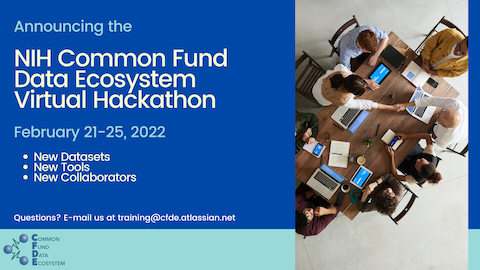
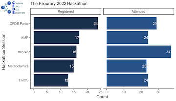

Title: The First Common Fund Data Ecosystem Hackathon
Date: 2022-03-05
Category: teaching
Tags: CFDE
Slug: 2022-feb-hackathon
Authors: Rayna Harris and Jessica Lumian
Summary: We ran a successful pilot hackathon, and we will run a second one soon!

The week of February 21-25, 2022, we hosted
[the first Common Fund Data Ecosystem (CFDE) Hackathon](https://nih-cfde.github.io/2022-feb-hackathon). The
goals of the hackathon were to increase familiarity with data sets
from [Common Fund programs](https://commonfund.nih.gov/programs) and
work towards cross-cutting, integrative analyses.

We invited members of the CFDE to propose hackathon sessions to
introduce their Common Fund data sets and provide technical support
while attendees explored the data. Sessions featured data from the
[CFDE Portal](https://app.nih-cfde.org/),
[Human Microbiome Project (HMP)](https://hmpdacc.org/),
[Extracellular RNA Communication (exRNA)](https://commonfund.nih.gov/exrna),
[Metabolomics Workbench (MW)](https://commonfund.nih.gov/metabolomics),
and
[Signature Commons Library of Integrated Network-Based Cellular Signatures (SigCom LINCS)](https://commonfund.nih.gov/LINCS).

## The Hackathon Sessions 

**All sessions were recorded and can be viewed on the [Session Details and Recordings](https://nih-cfde.github.io/2022-feb-hackathon/about/) page of the hackathon website!**

This virtual event began Monday morning with a welcome address by Dr. Titus Brown (UC Davis) followed by presentations from each Common Fund Program to give a brief overview of their data and session goals.

On Monday afternoon, Dr. Amanda Charbonneau (UC Davis) taught
attendees how to use the [**CFDE Portal**](https://app.nih-cfde.org/)
to find datasets from participating Common Fund
programs. Dr. Charbonneau used **HMP** data as a motivating example,
then helped attendees discover data sets from other programs. These
datasets are quite large, so on Tuesday afternoon, Dr. Charbonneau
taught a second session on how to download and process data from the
CFDE Portal using Amazon Web Services (AWS). Attendees were provided
with AWS accounts that they could use to analyze data discovered
through the portal.

On Tuesday morning, Emily LaPlante and Keyang Yu (Baylor College of
Medicine) provided an overview of the
**[exRNA Atlas](https://exrna-atlas.org/)**, which contains over 7,500
small RNA sequences and qPCR profiles from human and mouse, and
introduced attendees to a variety of software tools for exploring RNA
binding proteins. This session explored two use cases:

1) Finding RNA binding proteins and their associated RNA cargo in a variety of human biofluids and exploring their utility as biomarkers

2) Exploring other sites across the genome by intersecting exRNA Atlas
data with regions of interest using BedGraph files, as well as
applying this approach to other datasets.

On Wednesday morning, Eoin Fahy and Mano Maurya (UCSD) introduced the
**[Metabolomics Workbench](https://www.metabolomicsworkbench.org/)**
database which contains over 164,000 molecular structures covering
100+ species! Attendees learned how to interact with the Metabolomics
Workbench Portal and then viewed a demonstration of
**[MetENP](https://www.biorxiv.org/content/10.1101/2020.11.20.391912v1)**,
an R package that enables detection of significant metabolites from
metabolite information.

The final data-driven hackathon session took place on Thursday afternoon. John
Erol Evangelista (Mt Sinai) introduced the **[SigCom LINCS](https://maayanlab.cloud/sigcom-lincs/#/SignatureSearch/UpDown)**
API which contains over 1.5 million gene expression signatures from LINCS,
the Gene Expression Tissue Project (GTEx), and Gene Expression Omnibus
databases (GEO). Then, Daniel Clarke (Mt Sinai) gave an introduction to
building **[Appyters](https://appyters.maayanlab.cloud/#/)** and how to
use the SigCom LINCS APIs within Appyters.  

On Friday we ran a Wrap Up and Future Directions session for
presenters to recap what happened at their sessions and talk about
future goals for their tools. This allowed everyone to learn about
sessions they might not have attended, and possibly spark interest in
watching the video recording of the session.

## Reflection

Overall the sessions were well attended and well received! In a
pre-hackathon survey, we asked participants which hackathon sessions
they were interested in attending. More people attended each session
than we anticipated, which indicated that the introduction session on
Monday was critical for spurring interest.

According to our survey, participants walked away with a greater understanding of Common Fund databases and tools, so we achieved our main goal of increasing familiarity with the diverse datasets supported by the Common Fund Data Ecosystem. Additionally, our team of trainers identified new Common Fund datasets that we plan on integrating into our [training program](https://training.nih-cfde.org/) in the future.  

A common observation was that some sessions felt more like webinars or
workshops than what the name "hackathon" implies. For our next
hackathon, we will work with presenters to define sessions as webinars
(a demonstration of a data tool), workshops (a training event with
live coding), or hackathons (a defined problem that participants work
on). We also received requests for more advanced notice and
information about the content of sessions, which we will incorporate
into our next round of event planning.

This event, along with many other online events, lacked the sense of
community that can be present with in person multi-day events. We
tried using GitHub Issues or Discussions to foster conversations
between participants, but these tools were rarely used. We are
thinking about how to address this for our next event, and we're open
to feedback!

Finally, the hackathon coordination team would like to reiterate our
thanks to all Common Fund groups that ran sessions for this event! We
could not have achieved a diversity of datasets and tools at this
event without your time and efforts.

## Next steps

We are excited to announce that **the second CFDE Hackathon will take
place April 25 - 29th!** We're going to fine tune the event
with the feedback from our February event, and we hope you will join
us!

If you are interested in learning more about attending the April 2022
Hackathon as a participant, please
[register here](https://www.nih-cfde.org/events/april-2022-hackathon/)!
We hope to see you there :)

---

_The Common Fund Data Ecosystem Training Program is funded by the
National Institutes of Health (1OT3OD025459-01)._
