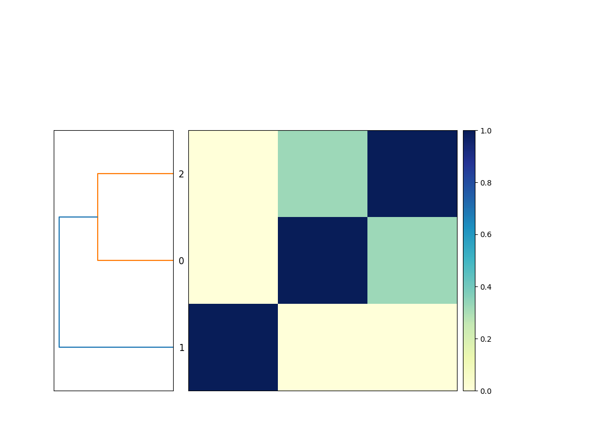

Title: snakemake for doing bioinformatics - a beginner's guide
Date: 2023-01-14
Category: science
Tags: snakemake, slithering
Slug: 2023-snakemake-slithering-section-1
Authors: C. Titus Brown
Summary: Slithering your way into bioinformatics with snakemake

(The below post contains excerpts from _Slithering your way into
bioinformatics with snakemake_, Hackmd Press, 2023.)

## Installation and setup!

### Setup and installation

I suggest working in a new directory.

You'll need to [install snakemake](https://snakemake.readthedocs.io/en/stable/getting_started/installation.html) and [sourmash](https://sourmash.readthedocs.io/en/latest/#installing-sourmash). We suggest using [conda, via miniforge](https://github.com/conda-forge/miniforge), for this.

#### Getting the data:

You'll need to download these three files:
* [GCF_000021665.1_ASM2166v1_genomic.fna.gz](https://ftp.ncbi.nlm.nih.gov/genomes/all/GCF/000/021/665/GCF_000021665.1_ASM2166v1/GCF_000021665.1_ASM2166v1_genomic.fna.gz)
* [GCF_000017325.1_ASM1732v1_genomic.fna.gz](https://ftp.ncbi.nlm.nih.gov/genomes/all/GCF/000/017/325/GCF_000017325.1_ASM1732v1/GCF_000017325.1_ASM1732v1_genomic.fna.gz)
* [GCF_000020225.1_ASM2022v1_genomic.fna.gz](https://ftp.ncbi.nlm.nih.gov/genomes/all/GCF/000/020/225/GCF_000020225.1_ASM2022v1/GCF_000020225.1_ASM2022v1_genomic.fna.gz)

and rename them so that they are in a subdirectory `genomes/` with the names:
```
GCF_000017325.1.fna.gz
GCF_000020225.1.fna.gz
GCF_000021665.1.fna.gz
```

Note, you can download saved copies of them here, with the right names: [osf.io/2g4dm/](https://osf.io/2g4dm/).


## Chapter 1 - snakemake runs programs for  you!

Bioinformatics often involves running many different programs to characterize and reduce sequencing data, and I use snakemake to help me do that.

### A first, simple snakemake workflow

Here's a simple, useful snakemake workflow:
```
rule compare_genomes:
    message: "compare all input genomes using sourmash"
    shell: """
        sourmash sketch dna -p k=31 genomes/*.fna.gz --name-from-first 
 
        sourmash compare GCF_000021665.1.fna.gz.sig \
            GCF_000017325.1.fna.gz.sig GCF_000020225.1.fna.gz.sig \
            -o compare.mat
 
        sourmash plot compare.mat
    """
```
Put it in a file called `Snakefile`, and run it with `snakemake -j 1`.

This will produce the output file `compare.mat.matrix.png` which contains a similarity matrix and a dendrogram of the three genomes (see Figure 1).



This is functionally equivalent to putting these three commands into a file `compare-genomes.sh` and running it with `bash compare-genomes.sh` -
```
sourmash sketch dna -p k=31 genomes/*.fna.gz --name-from-first 
 
sourmash compare GCF_000021665.1.fna.gz.sig \
            GCF_000017325.1.fna.gz.sig GCF_000020225.1.fna.gz.sig \
            -o compare.mat 
 
sourmash plot compare.mat 
```
The snakemake version is already a little bit nicer because it will give you encouragement when the commands run successfully (with nice green text saying "1 of 1 steps (100%) done"!) and if the commands fail you'll get red text alerting you to that, too.

But! We can further improve the snakemake version over the shell script version!

### Avoiding unnecessary rerunning of commands: a second snakemake workflow

The commands will run every time you invoke snakemake with `snakemake -j 1`. But most of the time you don't need to rerun them because you've already got the output files you wanted!

We can tell snakemake what we expect the output to be by adding an `output:` block in front of the shell block:
```
rule compare_genomes:
    message: "compare all input genomes using sourmash"
    output:
        "compare.mat.matrix.png"
    shell: """
        sourmash sketch dna -p k=31 genomes/*.fna.gz --name-from-first

        sourmash compare GCF_000021665.1.fna.gz.sig \
            GCF_000017325.1.fna.gz.sig GCF_000020225.1.fna.gz.sig \
            -o compare.mat

        sourmash plot compare.mat
    """

```
and now when we run `snakemake -j 1` once, it will run the commands; but when we run it again, it will say, "Nothing to be done (all requested files are present and up to date)."

This is because the desired output file, `compare.mat.matrix.png`, already exists. So snakemake knows it doesn't need to do anything!

If you remove `compare.mat.matrix.png` and run `snakemake -j 1` again, snakemake will happily make the files again:
```
rm compare.mat.matrix.png
snakemake -j 1
```

So snakemake makes it easy to avoid re-running a set of commands if it has already produced the files you wanted.

### Running only the commands you need to run

The last Snakefile above has three commands in it, but if you remove the `compare.mat.matrix.png` file you only need to run the last command again - the files created by the first two commands already exist and don't need to be recreated. However, snakemake doesn't know that - it treats the entire rule as one rule, and doesn't look into the shell command to work out what it doesn't need to run.

If we want to avoid re-creating the files that already exist, we need to make the Snakefile a little bit more complicated.

First, let's break out the commands into three separate rules.
```
rule sketch_genomes:
    shell: """
        sourmash sketch dna -p k=31 genomes/*.fna.gz --name-from-first
    """

rule compare_genomes:
    shell: """
        sourmash compare GCF_000021665.1.fna.gz.sig \
            GCF_000017325.1.fna.gz.sig GCF_000020225.1.fna.gz.sig \
            -o compare.mat
    """

rule plot_comparison:
    message: "compare all input genomes using sourmash"
    output:
        "compare.mat.matrix.png"
    shell: """
        sourmash plot compare.mat
    """
```

We didn't do anything too complicated here - we made two new rule blocks, with their own names, and split the shell commands up so that each shell command has its own rule block.

You can tell snakemake to run all three:
```
snakemake -j 1 sketch_genomes compare_genomes plot_comparison
```
and it will successfully run them all!

However, we're back to snakemake running some of the commands every time - it won't run `plot_comparison` every time, because `compare.mat.matrix.png` exists, but it will run `sketch_genomes` and `compare_genomes` repeatedly.

How do we fix this?

### Adding output blocks to each rule

```
rule sketch_genomes:
    output:
        "GCF_000017325.1.fna.gz.sig",
        "GCF_000020225.1.fna.gz.sig",
        "GCF_000021665.1.fna.gz.sig"
    shell: """
        sourmash sketch dna -p k=31 genomes/*.fna.gz --name-from-first
    """

rule compare_genomes:
    output:
        "compare.mat"
    shell: """
        sourmash compare GCF_000021665.1.fna.gz.sig \
            GCF_000017325.1.fna.gz.sig GCF_000020225.1.fna.gz.sig \
            -o compare.mat
    """

rule plot_comparison:
    message: "compare all input genomes using sourmash"
    output:
        "compare.mat.matrix.png"
    shell: """
        sourmash plot compare.mat
    """
```
and now
```
snakemake -j 1 sketch_genomes compare_genomes plot_comparison
```
will run each command only once, as long as the output files are still there. Huzzah!

But we still have to specify the names of all three rules, in the right order, to run this. That's annoying! Let's fix that next.

## Chapter 2: snakemake connects rules for you!

### Chaining rules with `input:` blocks

If we give snakemake information about what input files a rule needs in order to run the shell command, it will automatically connect the dots and run the rules that _produce_ those input files:
```
rule sketch_genomes:
    output:
        "GCF_000017325.1.fna.gz.sig",
        "GCF_000020225.1.fna.gz.sig",
        "GCF_000021665.1.fna.gz.sig"
    shell: """
        sourmash sketch dna -p k=31 genomes/*.fna.gz --name-from-first
    """

rule compare_genomes:
    input:
        "GCF_000017325.1.fna.gz.sig",
        "GCF_000020225.1.fna.gz.sig",
        "GCF_000021665.1.fna.gz.sig"
    output:
        "compare.mat"
    shell: """
        sourmash compare GCF_000021665.1.fna.gz.sig \
            GCF_000017325.1.fna.gz.sig GCF_000020225.1.fna.gz.sig \
            -o compare.mat
    """

rule plot_comparison:
    message: "compare all input genomes using sourmash"
    input:
        "compare.mat"
    output:
        "compare.mat.matrix.png"
    shell: """
        sourmash plot compare.mat
    """
```
and now you can just ask for the final rule that you want run:
```
snakemake -j 1 plot_comparison
```
and snakemake will run the other rules only if those input files don't exist and need to be created.

### Taking a step back

The Snakefile is now a lot longer, but it's not _too_ much more complicated - what we've done is split the shell commands up into separate rules and annotated each rule with information  about what file it produces (the output), and what files it requires in order to run (the input).

This has the advantage of making it so you don't need to rerun commands unnecessarily. This is only a small advantage with our current workflow, because sourmash is pretty fast. But if each step takes an hour to run, avoiding unnecessary steps can make your work go much faster!

And, as you'll see later, these rules are reusable building blocks that can be incorporated into workflows that each produce different files. So there are other good reasons to break shell commands out into individual rules!

## Chapter 3: snakemake helps you avoid redundancy!

### Avoiding repeated filenames by using `{input}` and `{output}`

If you look at the previous Snakefile, you'll see a few repeated filenames - in particular, rule `compare_genomes` has three filenames in the input block and then repeats them in the shell block, and `compare.mat` is repeated several times in both `compare_genomes` and `plot_genomes`.

We can tell snakemake to reuse filenames by using `{input}` and `{output}`. The `{` and `}` tell snakemake to interpret these not as literal strings but as template variables that should be replaced with the value of `input` and `output`.

Let's give it a try!
```
rule sketch_genomes:
    output:
        "GCF_000017325.1.fna.gz.sig",
        "GCF_000020225.1.fna.gz.sig",
        "GCF_000021665.1.fna.gz.sig"
    shell: """
        sourmash sketch dna -p k=31 genomes/*.fna.gz --name-from-first
    """

rule compare_genomes:
    input:
        "GCF_000017325.1.fna.gz.sig",
        "GCF_000020225.1.fna.gz.sig",
        "GCF_000021665.1.fna.gz.sig"
    output:
        "compare.mat"
    shell: """
        sourmash compare {input} -o {output}
    """

rule plot_comparison:
    message: "compare all input genomes using sourmash"
    input:
        "compare.mat"
    output:
        "compare.mat.matrix.png"
    shell: """
        sourmash plot {input}
    """
```

This approach not only involves less typing in the first place, but also makes it so that you only have to edit filenames in one place. This avoids mistakes caused by adding or changing filenames in one place and not another place - a mistake I've made plenty of times!

### snakemake makes it easy to rerun workflows!

It is common to want to rerun an entire workflow from scratch, to make sure that you're using the latest data files and software. Snakemake makes this easy!

You can ask snakemake to clean up all the files that it knows how to generate - and _only_ those files:
```
snakemake -j 1 plot_comparison --delete-all-output
```
which can then be followed by asking snakemake to regenerate the results:
```
snakemake -j 1 plot_comparison 
```

### snakemake will alert you to missing files if it can't make them!

Suppose you add a new file that does not exist to `compare_genomes`:

```
rule sketch_genomes:
    output:
        "GCF_000017325.1.fna.gz.sig",
        "GCF_000020225.1.fna.gz.sig",
        "GCF_000021665.1.fna.gz.sig"
    shell: """
        sourmash sketch dna -p k=31 genomes/*.fna.gz --name-from-first
    """

rule compare_genomes:
    input:
        "GCF_000017325.1.fna.gz.sig",
        "GCF_000020225.1.fna.gz.sig",
        "GCF_000021665.1.fna.gz.sig",
        "does-not-exist.sig"
    output:
        "compare.mat"
    shell: """
        sourmash compare {input} GCF_000021665.1.sig -o {output}
    """

rule plot_comparison:
    message: "compare all input genomes using sourmash"
    input:
        "compare.mat"
    output:
        "compare.mat.matrix.png"
    shell: """
        sourmash plot {input}
    """
```

Here, `does-not-exist.sig` doesn't exist, and we haven't given snakemake a rule to make it, either. What will snakemake do??

It will complain, loudly and clearly! And it will do so before running anything.

```
rm compare.mat

Missing input files for rule compare_genomes:
    output: compare.mat
    affected files:
        does-not-exist.sig
```

This is exactly what you want - a clear indication of what is missing before your workflow runs.

## Next steps

We've introduced basic snakemake workflows, which give you a simple way to run shell commands in the right order. snakemake already offers a few nice improvements over running the shell commands by yourself or in a shell script -

* it doesn't run shell commands if you already have all the files you need
* it lets you avoid typing the same filenames over and over again
* it gives simple, clear errors when something fails

While this functionality is nice, there are many more things we can do to improve the efficiency of our bioinformatics!

In the next section, we'll explore 

- writing more generic rules using _wildcards_;
- typing fewer filenames by using more templates;
- providing a list of default output files to produce;
- running commands in parallel on a single computer
- loading lists of filenames from spreadsheets
- configuring workflows with input files
