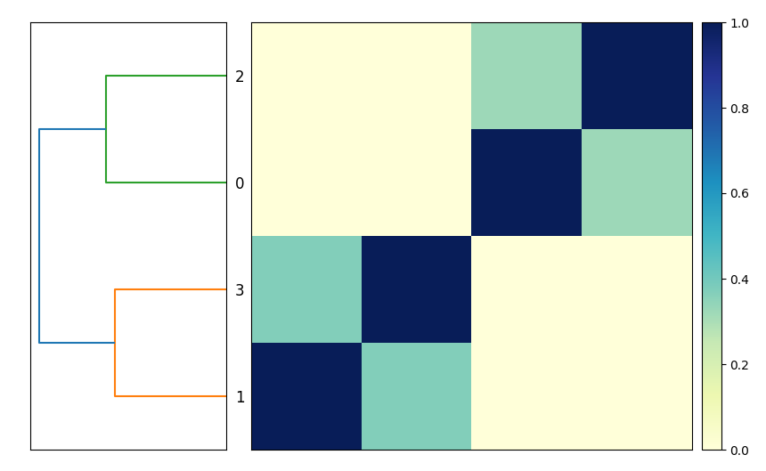

Title: snakemake for doing bioinformatics - a beginner's guide (part 2)
Date: 2023-01-14
Category: science
Tags: snakemake, slithering
Slug: 2023-snakemake-slithering-section-2
Authors: C. Titus Brown
Summary: Slithering your way into bioinformatics with snakemake

(The below post contains excerpts from _Slithering your way into
bioinformatics with snakemake_, Hackmd Press, 2023.)

@@add link to section 1

In Section 2, we'll explore a number of important features of
snakemake.  Together with Section 1, this section covers the core set
of snakemake functionality that you need to know in order to effectively
leverage snakemake.

After this section, you'll be well positioned to write a few workflows
of your own, and then you can come back and explore more advanced
features as you need them.

@ add a summary of where we got to previously

## Chapter 4: running rules in parallel

Let's take a look at the `sketch_genomes` rule from the last
`Snakefile` entry:

(@CTB note: Section 1 should be modified to have these explicit filenames
in there!)

```python
rule sketch_genomes:
    input:
        "genomes/GCF_000017325.1.fna.gz",
        "genomes/GCF_000020225.1.fna.gz",
        "genomes/GCF_000021665.1.fna.gz",
    output:
        "GCF_000017325.1.fna.gz.sig",
        "GCF_000020225.1.fna.gz.sig",
        "GCF_000021665.1.fna.gz.sig"
    shell: """
        sourmash sketch dna -p k=31 {input} \
            --name-from-first
    """
```

This command works fine as it is, but it is _slightly_ awkward - because,
bioinformatics being bioinformatics, we are likely to want to add more
genomes into the comparison at some point, and right now each additional
genome is going to have to be added to both input and output.  It's not
a lot of work, but it's unnecessary.

Moreover, if add in a _lot_ of genomes, then this step could quickly
become a bottleneck. `sourmash sketch` may run quickly on 10 or 20 genomes,
but it will slow down if you give it 100 or 1000! (In fact, `sourmash sketch`
will actually take 100 times longer on 100 genomes than on 1.) Is there
a way to speed that up?

Yes - we can write a rule that can be run for each genome, and then
ask snakemake to run it in parallel for us!

Note: sometimes you have to have a single rule that deals with all of
the genomes - for example, `compare_genomes` has to compare _all_ the
genomes, and there's no simple way around that. But with `sketch_genomes`,
we do have a simple option!

Let's start by breaking this one rule into three _separate_ rules:

```python
rule sketch_genomes_1:
    input:
        "genomes/GCF_000017325.1.fna.gz",
    output:
        "GCF_000017325.1.fna.gz.sig",
    shell: """
        sourmash sketch dna -p k=31 {input} \
            --name-from-first
    """

rule sketch_genomes_2:
    input:
        "genomes/GCF_000020225.1.fna.gz",
    output:
        "GCF_000020225.1.fna.gz.sig",
    shell: """
        sourmash sketch dna -p k=31 {input} \
            --name-from-first
    """

rule sketch_genomes_3:
    input:
        "genomes/GCF_000021665.1.fna.gz",
    output:
        "GCF_000021665.1.fna.gz.sig"
    shell: """
        sourmash sketch dna -p k=31 {input} \
            --name-from-first
    """
    
# rest of Snakefile here!
```

It's wordy, but it will work - run:

```shell
snakemake -j 1 --delete-all plot_comparison
snakemake -j 1 plot_comparison
```

Before we modify the file further, let's enjoy the fruits of our labor:
we can now tell snakemake to run more than one rule at a time!

@CTB note: is there a way to ask snakemake to just rerun everything? force?

Try typing this:
```shell
snakemake -j 1 --delete-all plot_comparison
snakemake -j 3 plot_comparison
```

If you look closely, you should see that snakemake is running all three
`sourmash sketch dna` commands _at the same time_.

This is actually pretty cool and is one of the more powerful practical
features of snakemake: once you tell snakemake _what you want it to
do_ (by specifying targets) and give snakemake the set of recipes
telling it _how to do each step_, snakemake will figure out the
fastest way to run all the necessary steps with the resources you've given it.

In this case, we told snakemake that it could run up to three jobs at
a time, with `-j 3`. We could also have told it to run more jobs at a
time, but at the moment there are only three rules that can actually
be run at the same time - `sketch_genomes_1`, `sketch_genomes_2`, and
`sketch_genomes_3`. This is because the rule `compare_genomes` needs the
output of these three rules to run, and likewise `plot_genomes` needs
the output of `compare_genomes` to run. So they can't be run at the
same time as any other rules!

## Chapter 5 - visualizing workflows

Let's visualize what we're doing.

@@ plot and DAGs; graphviz install


## Chapter 6 - using wildcards to make rules more generic

Let's take another look at one of those `sketch_genomes_` rules:
```python
rule sketch_genomes_1:
    input:
        "genomes/GCF_000017325.1.fna.gz",
    output:
        "GCF_000017325.1.fna.gz.sig",
    shell: """
        sourmash sketch dna -p k=31 {input} \
            --name-from-first
    """
```

There's some redundancy in there - the accession `GCF_000017325.1` shows up
twice. Can we do anything about that?

Yes, we can! We can use a snakemake feature called "wildcards", which will
let us give snakemake a blank space to fill in automatically.

With wildcards, you signal to snakemake that a particular part of an
input or output filename is fair game for substitutions using `{` and `}`
surrounding the wildcard name. Let's create a wildcard named `accession`
and put it into the input and output blocks for the rule:

```python
rule sketch_genomes_1:
    input:
        "genomes/{accession}.fna.gz",
    output:
        "{accession}.fna.gz.sig",
    shell: """
        sourmash sketch dna -p k=31 {input} \
            --name-from-first
    """
```

What this does is tell snakemake that whenever you want an output file
ending with `.fna.gz.sig`, you should look for a file with that prefix
(the text before `.fna.gz.sig`) in the `genomes/` directory, ending in
`.fna.gz`, and **if it exists**, use that file as the input.

(Yes, there can be multiple wildcards in a rule! We'll show you that later!)

If you go through and use the wildcards in `sketch_genomes_2` and
`sketch_genomes_3`, you'll notice that the rules end up looking _identical_.
And, as it turns out, you only need (and in fact can only have) one rule -
you can now collapse the three rules into one `sketch_genome` rule again.

Here's the full `Snakefile`:
```python
rule sketch_genome:
    input:
        "genomes/{accession}.fna.gz",
    output:
        "{accession}.fna.gz.sig",
    shell: """
        sourmash sketch dna -p k=31 {input} --name-from-first
    """

rule compare_genomes:
    input:
        "GCF_000017325.1.fna.gz.sig",
        "GCF_000020225.1.fna.gz.sig",
        "GCF_000021665.1.fna.gz.sig"
    output:
        "compare.mat"
    shell: """
        sourmash compare {input} -o {output}
    """

rule plot_comparison:
    message: "compare all input genomes using sourmash"
    input:
        "compare.mat"
    output:
        "compare.mat.matrix.png"
    shell: """
        sourmash plot {input}
    """

```

It looks a lot like the Snakefile we started with, with the crucial
difference that we are now using wildcards.

Here, unlike the situation we were in at the end of last section where
we had one rule that sketched three genomes, we now have one rule
that sketches one genome at a time, but also can be run in parallel!
So `snakemake -j 3` will still work! And it will continue to work as
you add more genomes in, and increase the number of jobs you want to
run at the same time.

Before we do that, let's take another look at the workflow now -
you'll notice that it's the same shape, but looks slightly different!
Now, instead of the three rules for sketching genomes having different names,
they all have the same name but have different values for the `accession` wildcard!


## Chapter 7 - giving snakemake filenames instead of rule names

Let's add a new genome into the mix, and start by generating a sketch
file (ending in `.sig`) for it.

Download the RefSeq assembly file (the `_genomic.fna.gz` file) for GCF_008423265.1 from [this NCBI link](https://www.ncbi.nlm.nih.gov/assembly/GCF_008423265.1), and put it in the `genomes/` subdirectory as `GCF_008423265.1.fna.gz`. (You can also download a saved copy with the right name from [this osf.io link](https://osf.io/7cdxn)).

Now, we'd like to build a sketch by running `sourmash sketch dna`
(via snakemake).

Do we need to add anything to the `Snakefile` to do this? No, no we don't!

To build a sketch for this new genome, you can just ask snakemake to make the
right filename like so:
```shell
snakemake -j 1 GCF_008423265.1.fna.gz.sig
```

Why does this work? It works because we have a generic wildcard rule for
building `.sig` files from files in `genomes/`!

When you ask snakemake to build that filename, it looks through all the
output blocks for its rules, and choose the rule with matching output -
importantly, this rule _can_ have wildcards, and if it does, it extracts
the wildcard from the filename!

### Warning: the `sketch_genome` rule has now changed!

As a side note, you can no longer ask snakemake to run the rule by its
name, `sketch_genome` - this is because the rule needs to fill in the
wildcard, and it can't know what `{accession}` should be without us
giving it the filename.

If you try running `snakemake -j 1 sketch_genome`, you'll get the following error:
>WorkflowError:
>Target rules may not contain wildcards. Please specify concrete files or a rule without wildcards at the command line, or have a rule without wildcards at the very top of your workflow (e.g. the typical "rule all" which just collects all results you want to generate in the end).

This is telling you that snakemake doesn't know how to fill in the wildcard
(and giving you some suggestions as to how you might do that, which we'll
explore below).

In this chapter we didn't need to modify the Snakefile at all to make use
of new functionality!

## Chapter 8 - adding new genomes

So we've got a new genome, and we can build a sketch for it. Let's
add it into our comparison, so we're building comparison matrix
for _four_ genomes, and not just three!

To add this new genome in to the comparison, all you need to do is add
the sketch into the `compare_genomes` input, and snakemake will
automatically locate the associated genome file and run
`sketch_genome` on it (as in the previous chapter), and then run
`compare_genomes` on it.  snakemake will take care of the rest!

```python
rule sketch_genome:
    input:
        "genomes/{accession}.fna.gz",
    output:
        "{accession}.fna.gz.sig",
    shell: """
        sourmash sketch dna -p k=31 {input} --name-from-first
    """

rule compare_genomes:
    input:
        "GCF_000017325.1.fna.gz.sig",
        "GCF_000020225.1.fna.gz.sig",
        "GCF_000021665.1.fna.gz.sig",
        "GCF_008423265.1.fna.gz.sig",
    output:
        "compare.mat"
    shell: """
        sourmash compare {input} -o {output}
    """

rule plot_comparison:
    message: "compare all input genomes using sourmash"
    input:
        "compare.mat"
    output:
        "compare.mat.matrix.png"
    shell: """
        sourmash plot {input}
    """
```

Now when you run `snakemake -j 3 plot_comparison` you will get a
`compare.mat.matrix.png` file that contains a 4x4 matrix! (See Figure.)



Note that the workflow diagram has now expanded to include our fourth genome, too!


## Chapter 9 - using `expand` to make filenames

You might note that the list of files in the `compare_genomes` rule
all share the same suffix, and they're all built using the same rule.
Can we use that in some way?

Yes! We can use a function called `expand(...)` and give it a template
filename to build, and a list of values to insert into that filename.

Below, we build a list of accessions named `ACCESSIONS`, and then use
`expand` to build the list of input files of the format `{acc}.fna.gz.sig`
from that list, creating one filename for each value in `ACCESSSIONS`.

```python
ACCESSIONS = ["GCF_000017325.1",
              "GCF_000020225.1",
              "GCF_000021665.1",
              "GCF_008423265.1"]

rule sketch_genome:
    input:
        "genomes/{accession}.fna.gz",
    output:
        "{accession}.fna.gz.sig",
    shell: """
        sourmash sketch dna -p k=31 {input} --name-from-first
    """

rule compare_genomes:
    input:
        expand("{acc}.fna.gz.sig", acc=ACCESSIONS),
    output:
        "compare.mat"
    shell: """
        sourmash compare {input} -o {output}
    """

rule plot_comparison:
    message: "compare all input genomes using sourmash"
    input:
        "compare.mat"
    output:
        "compare.mat.matrix.png"
    shell: """
        sourmash plot {input}
    """
```

While wildcards and `expand` use the same syntax, they do quite different
things.

`expand` generates a list of filenames, based on a template and a list
of values to insert into the template. It is typically used to make a
list of files that you want snakemake to create for you.

Wildcards in rules provide the rules by which one or more files will
be actually created. They are recipes that say, "when you want to make
a file with name that looks like THIS, you can do so from files that
look like THAT, and here's what to run to make that happen.

`expand` tells snakemake WHAT you want to make, wildcard rules tell
snakemake HOW to make those things.

## Chapter 10 - using default rules

The last change we'll make the Snakefile for this section is
to add what's known as a default rule. What is this and why?

The 'why' is easier. Above, we've been careful to provide specific rule
names or filenames to snakemake, because otherwise it defaults to running
the first rule in the Snakefile. (There's no other way in which the order
of rules in the file matters - but snakemake will try to run the first
rule in the file if you don't give it a rule name or a filename on the
command line.)

This is less than great, because it's one more thing to remember and to
type. In general, it's better to have what's called a "default rule"
that lets you just run `snakemake -j 1` to generate the file or files you
want.

This is straightforward to do, but it involves a slightly different syntax -
a rule with _only_ an `input`, and no shell or output blocks. Here's
a default rule for our Snakefile that should be put in the file as
the first rule:

```python
rule all:
    input:
        "compare.mat.matrix.png"
```

What this rule says is, "I want the file `compare.mat.matrix.png`."
It doesn't give any instructions on how to do that - that's what the
rest of the rules in the file are! - and it doesn't _run_ anything,
because it has no shell block, and nor does it _create_ anything,
because it has no output block.

The logic here is simple, if not straightforward: this rule succeeds
when that input exists.

If you place that at the top of the Snakefile, then running
`snakemake -j 1` will produce `compare.mat.matrix.png`. You no
longer need to provide either a rule name or a filename on the command
line unless you want to do something _other_ than generate that file,
in which case whatever you put on the command line will ignore
the `rule all:`.

## Chapter 11 - our final Snakefile - review and discussion

Here's the final Snakefile:

```python
ACCESSIONS = ["GCF_000017325.1",
              "GCF_000020225.1",
              "GCF_000021665.1",
              "GCF_008423265.1"]

rule all:
    input:
        "compare.mat.matrix.png"

rule sketch_genome:
    input:
        "genomes/{accession}.fna.gz",
    output:
        "{accession}.fna.gz.sig",
    shell: """
        sourmash sketch dna -p k=31 {input} --name-from-first
    """

rule compare_genomes:
    input:
        expand("{acc}.fna.gz.sig", acc=ACCESSIONS),
    output:
        "compare.mat"
    shell: """
        sourmash compare {input} -o {output}
    """

rule plot_comparison:
    message: "compare all input genomes using sourmash"
    input:
        "compare.mat"
    output:
        "compare.mat.matrix.png"
    shell: """
        sourmash plot {input}
    """
```

@@ add discussion!
