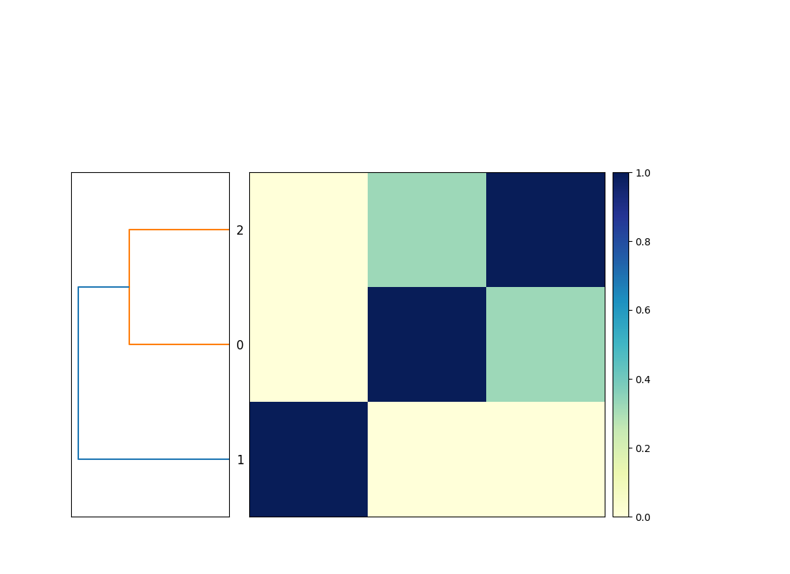

Title: snakemake for doing bioinformatics - a beginner's guide (part 2)
Date: 2023-01-14
Category: science
Tags: snakemake, slithering
Slug: 2023-snakemake-slithering-section-2
Authors: C. Titus Brown
Summary: Slithering your way into bioinformatics with snakemake

(The below post contains excerpts from _Slithering your way into
bioinformatics with snakemake_, Hackmd Press, 2023.)

@@link

In Section 2, we'll explore a number of important features of
snakemake.  Together with Section 1, this section covers the core set
of snakemake functionality we think you should learn. After this
section, you'll be well positioned to write a few workflows of your
own, and then you can come back and explore more advanced features as
you need them.

## Chapter 4: running rules in parallel

Let's take a look at the `sketch_genomes` rule from the last
`Snakefile` entry:

(CTB note: Section 1 should be modified to have these explicit filenames
in there!)

```python
rule sketch_genomes:
    input:
        "genomes/GCF_000017325.1.fna.gz",
        "genomes/GCF_000020225.1.fna.gz",
        "genomes/GCF_000021665.1.fna.gz",
    output:
        "GCF_000017325.1.fna.gz.sig",
        "GCF_000020225.1.fna.gz.sig",
        "GCF_000021665.1.fna.gz.sig"
    shell: """
        sourmash sketch dna -p k=31 {input} \
            --name-from-first
    """
```

This command works fine as it is, but it is _slightly_ awkward - because,
bioinformatics being bioinformatics, we are likely to want to add more
genomes into the comparison at some point, and right now each additional
genome is going to have to be added to both input and output.  It's not
a lot of work, but it's unnecessary.

Moreover, if add in a _lot_ of genomes, then this step could quickly
become a bottleneck. `sourmash sketch` may run quickly on 10 or 20 genomes,
but it will slow down if you give it 100 or 1000! (In fact, `sourmash sketch`
will actually take 100 times longer on 100 genomes than on 1.) Is there
a way to speed that up?

Yes - we can write a rule that can be run for each genome, and then
ask snakemake to run it in parallel for us!

Note: sometimes you have to have a single rule that deals with all of
the genomes - for example, `compare_genomes` has to compare _all_ the
genomes, and there's no simple way around that. But with `sketch_genomes`,
we do have a simple option!

Let's start by breaking this one rule into three _separate_ rules:

```python
rule sketch_genomes_1:
    input:
        "genomes/GCF_000017325.1.fna.gz",
    output:
        "GCF_000017325.1.fna.gz.sig",
    shell: """
        sourmash sketch dna -p k=31 {input} \
            --name-from-first
    """

rule sketch_genomes_2:
    input:
        "genomes/GCF_000020225.1.fna.gz",
    output:
        "GCF_000020225.1.fna.gz.sig",
    shell: """
        sourmash sketch dna -p k=31 {input} \
            --name-from-first
    """

rule sketch_genomes_3:
    input:
        "genomes/GCF_000021665.1.fna.gz",
    output:
        "GCF_000021665.1.fna.gz.sig"
    shell: """
        sourmash sketch dna -p k=31 {input} \
            --name-from-first
    """
    
# rest of Snakefile here!
```

It's wordy, but it will work - run:

```shell
snakemake -j 1 --delete-all plot_comparison
snakemake -j 1 plot_comparison
```

Before we modify the file further, let's enjoy the fruits of our labor:
we can now tell snakemake to run more than one rule at a time!

CTB note: is there a way to ask snakemake to just rerun everything? force?

Try typing this:
```shell
snakemake -j 1 --delete-all plot_comparison
snakemake -j 3 plot_comparison
```

If you look closely, you should see that snakemake is running all three
`sourmash sketch dna` commands _at the same time_.

This is actually pretty cool and is one of the more powerful practical
features of snakemake: once you tell snakemake _what you want it to do_
(by specifying targets) and give snakemake the set of recipes, snakemake
will figure out the fastest way to run it within the computational
constraints you give it.

In this case, we told snakemake that it could run up to three jobs
at a time, with `-j 3`. We could also have told it to run more, but
at the moment there are only three rules that can actually be run
at the same time - `sketch_genomes_1`, `sketch_genomes_2`, and
`sketch_genomes_3` - because the rule `compare_genomes` needs the
output of these three rules to run, and likewise `plot_genomes`
needs the output of `compare_genomes` to run. So they can't be run
at the same time as any other rules!

## Chapter 5 - visualizing workflows

Let's visualize what we're doing.

@@ plot and DAGs; graphviz install

## Chapter 6 - using wildcards to make rules more generic

Let's take another look at one of those `sketch_genomes_` rules:
```python
rule sketch_genomes_1:
    input:
        "genomes/GCF_000017325.1.fna.gz",
    output:
        "GCF_000017325.1.fna.gz.sig",
    shell: """
        sourmash sketch dna -p k=31 {input} \
            --name-from-first
    """
```

There's some redundancy in there - the accession `GCF_000017325.1` shows up
twice. Can we do anything about that?

Yes, we can! We can use a snakemake feature called "wildcards", which will
let us give snakemake a blank space to fill in automatically.

With wildcards, you signal to snakemake that a particular part of an
input or output filename is fair game for substitutions using `{` and `}`
surrounding the wildcard name. Let's create a wildcard named `accession`
and put it into the input and output blocks for the rule:

```python
rule sketch_genomes_1:
    input:
        "genomes/{accession}.fna.gz",
    output:
        "{accession}.fna.gz.sig",
    shell: """
        sourmash sketch dna -p k=31 {input} \
            --name-from-first
    """
```

What this does is tell snakemake that whenever you want an output file
ending with `.fna.gz.sig`, you should look for a file with that prefix
(the text before `.fna.gz.sig`) in the `genomes/` directory, ending in
`.fna.gz`, and **if it exists**, use that file as the input.

(Yes, there can be multiple wildcards in a rule! We'll show you that later!)

If you go through and use the wildcards in `sketch_genomes_2` and
`sketch_genomes_3`, you'll notice that the rules end up looking _identical_.
And, as it turns out, you only need (and in fact can only have) one rule -
you can now collapse the three rules into one `sketch_genome` rule again.

Here's the full `Snakefile`:
```python
rule sketch_genome:
    input:
        "genomes/{accession}.fna.gz",
    output:
        "{accession}.fna.gz.sig",
    shell: """
        sourmash sketch dna -p k=31 {input} --name-from-first
    """

rule compare_genomes:
    input:
        "GCF_000017325.1.fna.gz.sig",
        "GCF_000020225.1.fna.gz.sig",
        "GCF_000021665.1.fna.gz.sig"
    output:
        "compare.mat"
    shell: """
        sourmash compare {input} -o {output}
    """

rule plot_comparison:
    message: "compare all input genomes using sourmash"
    input:
        "compare.mat"
    output:
        "compare.mat.matrix.png"
    shell: """
        sourmash plot {input}
    """

```

It looks a lot like the Snakefile we started with, with the crucial
difference that we are now using wildcards.

Now, unlike the situation we were in at the end of last section where
we had one rule that sketched three genomes, we now have one rule
that sketches one genome at a time, but also can be run in parallel!
So `snakemake -j 3` will still work! And it will continue to work as
you add more genomes in, and increase the number of jobs you want to
run at the same time.

Before we do that, let's take another look at the workflow now -
you'll notice that it's the same shape, but looks slightly different!
@@

## Chapter 7 - giving snakemake filenames instead of rule names

(@@ download new genome)

GCF_008423265.1.fna.gz

(@@ calculate new)

To build a sketch for this, you can just ask snakemake to make the
right filename like so:
```shell
snakemake -j 1 GCF_008423265.1.fna.gz.sig
```

When you ask snakemake to build that filename, it looks through all the
output blocks for its rules, and choose that rule with matching output -
importantly, this rule _can_ have wildcards, and if it does, it extracts
the wildcard from the filename!

Interestingly, you can no longer ask snakemake to run the rule by its
name, `sketch_genome` - this is because the rule needs to fill in the
wildcard, and it can't know what `{accession}` should be without us
giving it the filename.

If you try running `snakemake -j 1 sketch_genome`, you'll get the following error:
>WorkflowError:
>Target rules may not contain wildcards. Please specify concrete files or a rule without wildcards at the command line, or have a rule without wildcards at the very top of your workflow (e.g. the typical "rule all" which just collects all results you want to generate in the end).

This is telling you that snakemake doesn't know how to fill in the wildcard
(and giving you some suggestions as to how you might do that, which we'll
explore below).

In this chapter we didn't need to modify the Snakefile at all to make use
of new functionality!

## Chapter 8 - adding new genomes

So we've got a new genome, and we can build a sketch for it. Let's
add it into our comparison, so we're building comparison matrix
for _four_ genomes, and not just three!

To add this new genome in to the comparison, all you need to do is add
the sketch into the `compare_genomes` input, and snakemake will
automatically locate the associated genome file and run
`sketch_genome` on it (as in the previous chapter), and then run
`compare_genomes` on it.  snakemake will take care of the rest!

```python
rule sketch_genome:
    input:
        "genomes/{accession}.fna.gz",
    output:
        "{accession}.fna.gz.sig",
    shell: """
        sourmash sketch dna -p k=31 {input} --name-from-first
    """

rule compare_genomes:
    input:
        "GCF_000017325.1.fna.gz.sig",
        "GCF_000020225.1.fna.gz.sig",
        "GCF_000021665.1.fna.gz.sig",
        "GCF_008423265.1.fna.gz.sig",
    output:
        "compare.mat"
    shell: """
        sourmash compare {input} -o {output}
    """

rule plot_comparison:
    message: "compare all input genomes using sourmash"
    input:
        "compare.mat"
    output:
        "compare.mat.matrix.png"
    shell: """
        sourmash plot {input}
    """
```

Now when you run `snakemake -j 3 plot_comparison` you will get a
`compare.mat.matrix.png` file that contains a 4x4 matrix! (See Figure.)

## Chapter 9 - using `expand` to make filenames

You might note that the list of files in the `compare_genomes` rule
all share the same suffix, and they're all built using the same rule.
Can we use that in some way?

Yes! We can use a function called `expand(...)` and give it a template
filename to build, and a list of values to insert into that filename.

Below, we build a list of accessions named `ACCESSIONS`, and then use
`expand` to build the list of input files of the format `{acc}.fna.gz.sig`
from that list, creating one filename for each value in `ACCESSSIONS`.

```python
ACCESSIONS = ["GCF_000017325.1",
              "GCF_000020225.1",
              "GCF_000021665.1",
              "GCF_008423265.1"]

rule sketch_genome:
    input:
        "genomes/{accession}.fna.gz",
    output:
        "{accession}.fna.gz.sig",
    shell: """
        sourmash sketch dna -p k=31 {input} --name-from-first
    """

rule compare_genomes:
    input:
        expand("{acc}.fna.gz.sig", acc=ACCESSIONS),
    output:
        "compare.mat"
    shell: """
        sourmash compare {input} -o {output}
    """

rule plot_comparison:
    message: "compare all input genomes using sourmash"
    input:
        "compare.mat"
    output:
        "compare.mat.matrix.png"
    shell: """
        sourmash plot {input}
    """
```

While wildcards and `expand` use the same syntax, they do quite different
things.

`expand` generates a list of filenames, based on a template and a list
of values to insert into the template. It is typically used to make a
list of files that you want snakemake to create for you.

Wildcards in rules provide the rules by which one or more files will
be actually created. They are recipes that say, "when you want to make
a file with name that looks like THIS, you can do so from files that
look like THAT, and here's what to run to make that happen.

`expand` tells snakemake WHAT you want to make, wildcard rules tell
snakemake HOW to make those things.

## Chapter 10 - using default rules

The last change we'll make the Snakefile for this section is
to add what's known as a default rule. What is this and why?

The 'why' is easier. Above, we've been careful to provide specific rule
names or filenames to snakemake, because otherwise it defaults to running
the first rule in the Snakefile. (There's no other way in which the order
of rules in the file matters - but snakemake will try to run the first
rule in the file if you don't give it a rule name or a filename on the
command line.)

This is less than great, because it's one more thing to remember and to
type. In general, it's better to have what's called a "default rule"
that lets you just run `snakemake -j 1` to generate the file or files you
want.

This is straightforward to do, but it involves a slightly different syntax -
a rule with _only_ an `input`, and no shell or output blocks. Here's
a default rule for our Snakefile that should be put in the file as
the first rule:

```python
rule all:
    input:
        "compare.mat.matrix.png"
```

What this rule says is, "I want the file `compare.mat.matrix.png`."
It doesn't give any instructions on how to do that - that's what the
rest of the rules in the file are! - and it doesn't _run_ anything,
because it has no shell block, and nor does it _create_ anything,
because it has no output block.

The logic here is simple, if not straightforward: this rule succeeds
when that input exists.

If you place that at the top of the Snakefile, then running
`snakemake -j 1` will produce `compare.mat.matrix.png`. You no
longer need to provide either a rule name or a filename on the command
line unless you want to do something _other_ than generate that file,
in which case whatever you put on the command line will ignore
the `rule all:`.

## Chapter 11 - our final Snakefile - review and discussion

Here's the final Snakefile:

```python
ACCESSIONS = ["GCF_000017325.1",
              "GCF_000020225.1",
              "GCF_000021665.1",
              "GCF_008423265.1"]

rule all:
    input:
        "compare.mat.matrix.png"

rule sketch_genome:
    input:
        "genomes/{accession}.fna.gz",
    output:
        "{accession}.fna.gz.sig",
    shell: """
        sourmash sketch dna -p k=31 {input} --name-from-first
    """

rule compare_genomes:
    input:
        expand("{acc}.fna.gz.sig", acc=ACCESSIONS),
    output:
        "compare.mat"
    shell: """
        sourmash compare {input} -o {output}
    """

rule plot_comparison:
    message: "compare all input genomes using sourmash"
    input:
        "compare.mat"
    output:
        "compare.mat.matrix.png"
    shell: """
        sourmash plot {input}
    """


## Installation and setup!

### Setup and installation

I suggest working in a new directory.

You'll need to [install snakemake](https://snakemake.readthedocs.io/en/stable/getting_started/installation.html) and [sourmash](https://sourmash.readthedocs.io/en/latest/#installing-sourmash). We suggest using [mamba, via miniforge/mambaforge](https://github.com/conda-forge/miniforge#mambaforge), for this.

#### Getting the data:

You'll need to download these three files:

* [GCF_000021665.1_ASM2166v1_genomic.fna.gz](https://ftp.ncbi.nlm.nih.gov/genomes/all/GCF/000/021/665/GCF_000021665.1_ASM2166v1/GCF_000021665.1_ASM2166v1_genomic.fna.gz)
* [GCF_000017325.1_ASM1732v1_genomic.fna.gz](https://ftp.ncbi.nlm.nih.gov/genomes/all/GCF/000/017/325/GCF_000017325.1_ASM1732v1/GCF_000017325.1_ASM1732v1_genomic.fna.gz)
* [GCF_000020225.1_ASM2022v1_genomic.fna.gz](https://ftp.ncbi.nlm.nih.gov/genomes/all/GCF/000/020/225/GCF_000020225.1_ASM2022v1/GCF_000020225.1_ASM2022v1_genomic.fna.gz)

and rename them so that they are in a subdirectory `genomes/` with the names:
```
GCF_000017325.1.fna.gz
GCF_000020225.1.fna.gz
GCF_000021665.1.fna.gz
```

Note, you can download saved copies of them here, with the right names: [osf.io/2g4dm/](https://osf.io/2g4dm/).


## Chapter 1 - snakemake runs programs for  you!

Bioinformatics often involves running many different programs to characterize and reduce sequencing data, and I use snakemake to help me do that.

### A first, simple snakemake workflow

Here's a simple, useful snakemake workflow:
```python
rule compare_genomes:
    message: "compare all input genomes using sourmash"
    shell: """
        sourmash sketch dna -p k=31 genomes/*.fna.gz --name-from-first 
 
        sourmash compare GCF_000021665.1.fna.gz.sig \
            GCF_000017325.1.fna.gz.sig GCF_000020225.1.fna.gz.sig \
            -o compare.mat
 
        sourmash plot compare.mat
    """
```
Put it in a file called `Snakefile`, and run it with `snakemake -j 1`.

This will produce the output file `compare.mat.matrix.png` which contains a similarity matrix and a dendrogram of the three genomes (see Figure 1).



This is functionally equivalent to putting these three commands into a file `compare-genomes.sh` and running it with `bash compare-genomes.sh` -

```shell
sourmash sketch dna -p k=31 genomes/*.fna.gz --name-from-first 
 
sourmash compare GCF_000021665.1.fna.gz.sig \
            GCF_000017325.1.fna.gz.sig GCF_000020225.1.fna.gz.sig \
            -o compare.mat 
 
sourmash plot compare.mat 
```

The snakemake version is already a little bit nicer because it will
give you encouragement when the commands run successfully (with nice
green text saying "1 of 1 steps (100%) done"!) and if the commands
fail you'll get red text alerting you to that, too.

But! We can further improve the snakemake version over the shell
script version!

### Avoiding unnecessary rerunning of commands: a second snakemake workflow

The commands will run every time you invoke snakemake with `snakemake -j 1`. But most of the time you don't need to rerun them because you've already got the output files you wanted!

How do you get snakemake to avoid rerunning rules?

We can do that by telling snakemake what we expect the output to be by adding an `output:` block in front of the shell block:
```python
rule compare_genomes:
    message: "compare all input genomes using sourmash"
    output:
        "compare.mat.matrix.png"
    shell: """
        sourmash sketch dna -p k=31 genomes/*.fna.gz --name-from-first

        sourmash compare GCF_000021665.1.fna.gz.sig \
            GCF_000017325.1.fna.gz.sig GCF_000020225.1.fna.gz.sig \
            -o compare.mat

        sourmash plot compare.mat
    """

```
and now when we run `snakemake -j 1` once, it will run the commands; but when we run it again, it will say, "Nothing to be done (all requested files are present and up to date)."

This is because the desired output file, `compare.mat.matrix.png`, already exists. So snakemake knows it doesn't need to do anything!

If you remove `compare.mat.matrix.png` and run `snakemake -j 1` again, snakemake will happily make the files again:
```shell
rm compare.mat.matrix.png
snakemake -j 1
```

So snakemake makes it easy to avoid re-running a set of commands if it
has already produced the files you wanted. This is one of the best
reasons to use a workflow system like snakemake for running
bioinformatics workflows; shell scripts don't automatically avoid
re-running commands.

### Running only the commands you need to run

The last Snakefile above has three commands in it, but if you remove the `compare.mat.matrix.png` file you only need to run the last command again - the files created by the first two commands already exist and don't need to be recreated. However, snakemake doesn't know that - it treats the entire rule as one rule, and doesn't look into the shell command to work out what it doesn't need to run.

If we want to avoid re-creating the files that already exist, we need to make the Snakefile a little bit more complicated.

First, let's break out the commands into three separate rules.
```python
rule sketch_genomes:
    shell: """
        sourmash sketch dna -p k=31 genomes/*.fna.gz --name-from-first
    """

rule compare_genomes:
    shell: """
        sourmash compare GCF_000021665.1.fna.gz.sig \
            GCF_000017325.1.fna.gz.sig GCF_000020225.1.fna.gz.sig \
            -o compare.mat
    """

rule plot_comparison:
    message: "compare all input genomes using sourmash"
    output:
        "compare.mat.matrix.png"
    shell: """
        sourmash plot compare.mat
    """
```

We didn't do anything too complicated here - we made two new rule blocks, with their own names, and split the shell commands up so that each shell command has its own rule block.

You can tell snakemake to run all three:
```shell
snakemake -j 1 sketch_genomes compare_genomes plot_comparison
```
and it will successfully run them all!

However, we're back to snakemake running some of the commands every time - it won't run `plot_comparison` every time, because `compare.mat.matrix.png` exists, but it will run `sketch_genomes` and `compare_genomes` repeatedly.

How do we fix this?

### Adding output blocks to each rule

If add output blocks to *each* rule, then snakemake will only run rules
where the output needs to be updated (e.g. because it doesn't exist).

Let's do that:

```python
rule sketch_genomes:
    output:
        "GCF_000017325.1.fna.gz.sig",
        "GCF_000020225.1.fna.gz.sig",
        "GCF_000021665.1.fna.gz.sig"
    shell: """
        sourmash sketch dna -p k=31 genomes/*.fna.gz --name-from-first
    """

rule compare_genomes:
    output:
        "compare.mat"
    shell: """
        sourmash compare GCF_000021665.1.fna.gz.sig \
            GCF_000017325.1.fna.gz.sig GCF_000020225.1.fna.gz.sig \
            -o compare.mat
    """

rule plot_comparison:
    message: "compare all input genomes using sourmash"
    output:
        "compare.mat.matrix.png"
    shell: """
        sourmash plot compare.mat
    """
```
and now
```
snakemake -j 1 sketch_genomes compare_genomes plot_comparison
```
will run each command only once, as long as the output files are still there. Huzzah!

But we still have to specify the names of all three rules, in the right order, to run this. That's annoying! Let's fix that next.

## Chapter 2: snakemake connects rules for you!

### Chaining rules with `input:` blocks

We can get snakemake to automatically connect rules by providing
information about the _input_ files a rule needs. Then, if you ask
snakemake to run a rule that requires certain inputs, it will
automatically figure out which rules produce those inputs as their
output, and automatically run them.

Let's add input information to the `plot_comparison` and `compare_genomes`
rules:

```python
rule sketch_genomes:
    output:
        "GCF_000017325.1.fna.gz.sig",
        "GCF_000020225.1.fna.gz.sig",
        "GCF_000021665.1.fna.gz.sig"
    shell: """
        sourmash sketch dna -p k=31 genomes/*.fna.gz --name-from-first
    """

rule compare_genomes:
    input:
        "GCF_000017325.1.fna.gz.sig",
        "GCF_000020225.1.fna.gz.sig",
        "GCF_000021665.1.fna.gz.sig"
    output:
        "compare.mat"
    shell: """
        sourmash compare GCF_000021665.1.fna.gz.sig \
            GCF_000017325.1.fna.gz.sig GCF_000020225.1.fna.gz.sig \
            -o compare.mat
    """

rule plot_comparison:
    message: "compare all input genomes using sourmash"
    input:
        "compare.mat"
    output:
        "compare.mat.matrix.png"
    shell: """
        sourmash plot compare.mat
    """
```

Now you can just ask snakemake to run the last rule:
```shell
snakemake -j 1 plot_comparison
```
and snakemake will run the other rules only if those input files don't exist and need to be created.

### Taking a step back

The Snakefile is now a lot longer, but it's not _too_ much more complicated - what we've done is split the shell commands up into separate rules and annotated each rule with information  about what file it produces (the output), and what files it requires in order to run (the input).

This has the advantage of making it so you don't need to rerun commands unnecessarily. This is only a small advantage with our current workflow, because sourmash is pretty fast. But if each step takes an hour to run, avoiding unnecessary steps can make your work go much faster!

And, as you'll see later, these rules are reusable building blocks that can be incorporated into workflows that each produce different files. So there are other good reasons to break shell commands out into individual rules!

## Chapter 3: snakemake helps you avoid redundancy!

### Avoiding repeated filenames by using `{input}` and `{output}`

If you look at the previous Snakefile, you'll see a few repeated filenames - in particular, rule `compare_genomes` has three filenames in the input block and then repeats them in the shell block, and `compare.mat` is repeated several times in both `compare_genomes` and `plot_genomes`.

We can tell snakemake to reuse filenames by using `{input}` and `{output}`. The `{` and `}` tell snakemake to interpret these not as literal strings but as template variables that should be replaced with the value of `input` and `output`.

Let's give it a try!
```python
rule sketch_genomes:
    output:
        "GCF_000017325.1.fna.gz.sig",
        "GCF_000020225.1.fna.gz.sig",
        "GCF_000021665.1.fna.gz.sig"
    shell: """
        sourmash sketch dna -p k=31 genomes/*.fna.gz --name-from-first
    """

rule compare_genomes:
    input:
        "GCF_000017325.1.fna.gz.sig",
        "GCF_000020225.1.fna.gz.sig",
        "GCF_000021665.1.fna.gz.sig"
    output:
        "compare.mat"
    shell: """
        sourmash compare {input} -o {output}
    """

rule plot_comparison:
    message: "compare all input genomes using sourmash"
    input:
        "compare.mat"
    output:
        "compare.mat.matrix.png"
    shell: """
        sourmash plot {input}
    """
```

This approach not only involves less typing in the first place, but also makes it so that you only have to edit filenames in one place. This avoids mistakes caused by adding or changing filenames in one place and not another place - a mistake I've made plenty of times!

### snakemake makes it easy to rerun workflows!

It is common to want to rerun an entire workflow from scratch, to make sure that you're using the latest data files and software. Snakemake makes this easy!

You can ask snakemake to clean up all the files that it knows how to generate - and _only_ those files:
```shell
snakemake -j 1 plot_comparison --delete-all-output
```
which can then be followed by asking snakemake to regenerate the results:
```
snakemake -j 1 plot_comparison 
```

### snakemake will alert you to missing files if it can't make them!

Suppose you add a new file that does not exist to `compare_genomes`:

```python
rule sketch_genomes:
    output:
        "GCF_000017325.1.fna.gz.sig",
        "GCF_000020225.1.fna.gz.sig",
        "GCF_000021665.1.fna.gz.sig"
    shell: """
        sourmash sketch dna -p k=31 genomes/*.fna.gz --name-from-first
    """

rule compare_genomes:
    input:
        "GCF_000017325.1.fna.gz.sig",
        "GCF_000020225.1.fna.gz.sig",
        "GCF_000021665.1.fna.gz.sig",
        "does-not-exist.sig"
    output:
        "compare.mat"
    shell: """
        sourmash compare {input} GCF_000021665.1.sig -o {output}
    """

rule plot_comparison:
    message: "compare all input genomes using sourmash"
    input:
        "compare.mat"
    output:
        "compare.mat.matrix.png"
    shell: """
        sourmash plot {input}
    """
```

Here, `does-not-exist.sig` doesn't exist, and we haven't given snakemake a rule to make it, either. What will snakemake do??

It will complain, loudly and clearly! And it will do so before running anything.

First, let's force the rule remove the output file that depends on the 
```shell
rm compare.mat
```

and then run `snakemake -j 1`. You should see:

```
Missing input files for rule compare_genomes:
    output: compare.mat
    affected files:
        does-not-exist.sig
```

This is exactly what you want - a clear indication of what is missing before your workflow runs.

## Next steps

We've introduced basic snakemake workflows, which give you a simple way to run shell commands in the right order. snakemake already offers a few nice improvements over running the shell commands by yourself or in a shell script -

* it doesn't run shell commands if you already have all the files you need
* it lets you avoid typing the same filenames over and over again
* it gives simple, clear errors when something fails

While this functionality is nice, there are many more things we can do to improve the efficiency of our bioinformatics!

In the next section, we'll explore 

- writing more generic rules using _wildcards_;
- typing fewer filenames by using more templates;
- providing a list of default output files to produce;
- running commands in parallel on a single computer
- loading lists of filenames from spreadsheets
- configuring workflows with input files
