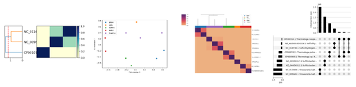

Title: Recent advances in the sourmash ecosystem (August 2024)
Date: 2024-08-16
Category: science
Tags: sourmash, branchwater
Slug: 2024-sourmash-advances
Authors: C. Titus Brown
Summary: sourmash is faster and better than before!

sourmash is our software for exploring and analyzing large collections of sequencing data - mostly focused on microbial genomics and metagenomics, but increasingly relevant to larger flora and fauna :). 

Our ongoing focus on incremental improvements to sourmash continues to bear fruit. Below, I discuss robust, publicly available, and documented features that are ready for others to use!

### Speed and memory improvements - multithreading has come to sourmash!

(Well, technically it has come to a plugin ;).

sourmash is [implemented under the hood](https://blog.luizirber.org/2018/08/23/sourmash-rust/) in Rust, a very fast language capable of multithreading. However, the command-line for sourmash is in Python, and for a variety of reasons we've never made it multithreaded.

Over the last year, we've started to take real advantage of the underlying Rust code by developing a plugin, [the sourmash branchwater plugin](https://github.com/sourmash-bio/sourmash_plugin_branchwater), that provides fast, low-memory, multithreaded search (`manysearch` and `multisearch`, metagenome decomposition (`fastgather` and `fastmultigather`), and sketching (`manysketch`), as well as some fast clustering (`cluster`).

These commands speed up sourmash by 100-1000x in many cases, and have really transformed our internal use of sourmash as a result.

Exactly how and why we did this in a plugin, and how we're going to evolve sourmash to make use of this functionality in the future, is a story that will be told in another blog post :).

### Improved visualization!

One of the main purposes of sourmash, if citations are to be believed, is for people to make and display distance matrices - the relevant commands are `sourmash compare` and `sourmash plot`.

But... the `plot` command hasn't aged well. It's got a lot of minor problems, and it's not that flexible. We've bandaged it as best we can given the constraints of semantic versioning ("thou shalt not break commands for the heck of it") but more was needed.

And, separately, we kept on building super cool new display options - including tSNE and MDS plots, coloring plots by categories, Venn diagrams, and so on. But a lot of these were in Jupyter notebooks or RMarkdown documents and weren't directly accessible to command-line users. And we also didn't want to add a bunch of viz dependencies like seaborn to core sourmash.

Moreover, Taylor Reiter provided a lot of inspiration with [`sourmashconsumr`](https://github.com/Arcadia-Science/sourmashconsumr/), but that hasn't been regularly maintained, and it's hard for us (me) to take over maintenance of an R package.

So, we implemented another plugin, [the `betterplot` plugin](https://github.com/sourmash-bio/sourmash_plugin_betterplot/), which has a simple naming scheme (`plot2`, `plot3`, etc.) that allows us to add new plot types really easily. As of this date, it supplies better distance matrices, tSNE and MDS plotting, and a few different plot formats.

<!-- montage -tile 4x1 -size 600x600 examples/plot2.cut.3sketches.cmp.png examples/mds.10sketches.cmp.png examples/plot3.10sketches.cmp.png examples/10sketches.upset.png montage.png -->

Here are some examples:

### New, ultra-scalable backend database system

The [branchwater plugin](https://github.com/sourmash-bio/sourmash_plugin_branchwater/blob/main/doc/README.md) also implements a straightforward command-line interface to our newest database type: an inverted index that uses [RocksDB](https://github.com/facebook/rocksdb underneath.

This database is demonstrably ultra-scalable: it is the index type underlying the petabase-scale search offered by the [branchwater Web site](https://branchwater.sourmash.bio/).

Making it available via the command-line interface means that we can experiment with it for other purposes - including metagenome decomposition via `fastgather`, as well as command-line metagenome search via `manysearch`. We're really excited about offering it as a simple, flexible way to index and search massive amounts of data!

### Plugins!

As of v4.6, [sourmash supports a few different kinds of plugins](http://ivory.idyll.org/blog/2023-sourmash-plugins-first-effort.html). That underlies a lot of what's going on above (for a few reasons that I'll elaborate on in a different blog post).

Plugins have proven to be super wonderful - they are letting us experiment with adding new commands that "look like" sourmash commands, and interact with sourmash data types, but don't incur the same support burden that semantic versioning does.

There's been some robust plugin action going on, too - I built a (slow, but pretty) containment search plugin, which inspired Dr. Tessa Pierce-Ward to implement the core functionality in Rust as part of the branchwater plugin, and then I backported the pretty printouts into the branchwater plugin (see [sourmash_plugin_branchwater#408](https://github.com/sourmash-bio/sourmash_plugin_branchwater/pull/408) for the denoument).

### Stability, maintenance, and releases

I spend a surprising amount of my time (as a tenured full prof at UC Davis) maintaining sourmash and some of the associated plugins: I answer most of the issues, debug most of the bugs, and cut most of the releases. I've had to learn Rust as part of the deal, and the current state of the code + plugins means that I spend a fair amount of time bouncing between different repositories trying to figure out where particular behavior is encoded.

Meanwhile, collaborators and colleagues and labmates use sourmash for their own work, extending it in new and exciting ways to enable new types of inquiry.

As a result of all of this, we've been able to provide an interesting mix of stability, documentation, tutorials, and new functionality. We're not quite sure where sourmash is going, but that's part of the fun, right?

What I, personally, am sure of, is this: there's value in long-term maintenance of cutting-edge research software, and that part of "cutting edge" can be "we're providing a stable platform and library with which to do new science." We'll see if I can convince a funding agency of this :)

--titus
