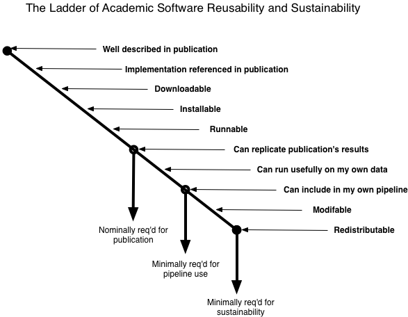

The Ladder of Academic Software Notsuck
#######################################

:author: C\. Titus Brown
:tags: science,software
:date: 2013-03-04
:slug: ladder-of-academic-software-notsuck
:category: science

I'm on my way down to D.C. to attend another meeting about
cyberinfrastructure, this time with a bent towards `metagenomics
pipelines
<http://ivory.idyll.org/blog/building-better-metagenomics-pipelines.html>`__.
(At least, I'm pretty sure that's why I'm invited.  It's getting hard
to tell these days.)

Inspired by James Watters' blog post on `his "fork you" shirt
<http://wattersjames.posterous.com/my-fork-you-shirt>`__, I decided to
revise my planned presentation a bit to talk more about what I hate so
much about most academic software.  I'll try to write more later, or
at least I'll blog after the workshop, but in the meantime: I give you,
The Ladder of Academic Software Reusability and Sustainability.

My personal experience with software is that approximately 1/2 of all
software drops off at each point, which means only 1 in a 1000 make
it to the last point -- and the last point is the *first* point where
the software is really forkable.

Comments, updates, etc. welcome.  Also see `the OmniGraffle source <images/ladder-of-academic-software.graffle>`__.

--titus

